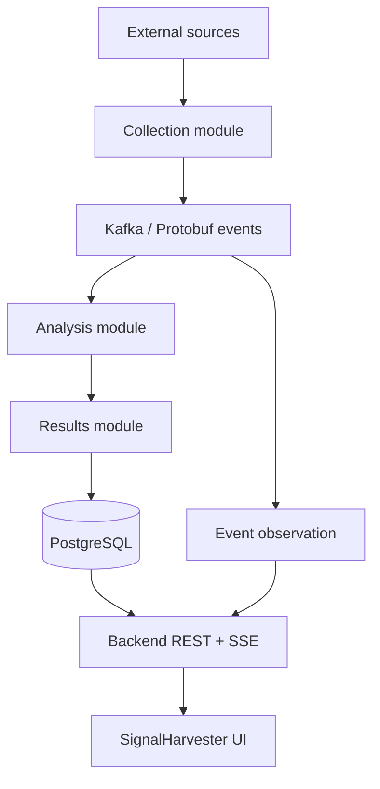

# SignalHarvester

SignalHarvester is a modular event-driven backend for collecting, analyzing, and presenting information from configurable external sources.

The first product focus is monitoring job vacancies and selected information topics. The backend is intentionally designed as a **modular monolith first**: one deployable Micronaut application composed from cohesive Gradle modules with explicit Java and event contracts. Kafka, PostgreSQL, Kubernetes, and observability remain first-class parts of the system without forcing every module to become a microservice.

## System at a glance



Kafka events are defined by versioned `.proto` files. In-process synchronous module collaboration uses Java interfaces/types. Browser and test clients use REST/JSON, and browser live updates use SSE/JSON.

## Companion UI project

The web frontend is a separate repository. The recommended repository slug is **`signalharvester-ui`**, with the product/display name **SignalHarvester UI**.

This backend repository owns the public REST/OpenAPI and SSE contracts consumed by the UI, but it does not own frontend implementation details.

For UI installation and run instructions, use the **UI repository's root `README.md`** as the initial authoritative guide. The UI project should have its own `docs/specs/` tree from the beginning. Separate UI `docs/INSTALLATION.md` and `docs/USAGE.md` files should be introduced only when setup/operation becomes too large or independently owned for a single README.

Backend [`docs/INSTALLATION.md`](docs/INSTALLATION.md) and [`docs/USAGE.md`](docs/USAGE.md) describe backend/infrastructure setup and operation only.

## Start here

| Goal | Read |
|---|---|
| Repository development rules | [`AGENTS.md`](AGENTS.md) |
| Product/system target and active work | [`docs/specs/README.md`](docs/specs/README.md) |
| Stable architecture boundaries | [`docs/ARCHITECTURE.md`](docs/ARCHITECTURE.md) |
| Current implementation state | [`docs/IMPLEMENTATION.md`](docs/IMPLEMENTATION.md) |
| Backend setup prerequisites | [`docs/INSTALLATION.md`](docs/INSTALLATION.md) |
| Backend usage/run workflows | [`docs/USAGE.md`](docs/USAGE.md) |
| Configuration ownership | [`docs/CONFIGURATION.md`](docs/CONFIGURATION.md) |
| Tests and validation | [`docs/TESTS.md`](docs/TESTS.md) |
| Product/technical roadmap | [`docs/ROADMAP.md`](docs/ROADMAP.md) |

## Repository structure

```text
signalharvester/
├── app/                         # Micronaut composition root
├── common/                      # Small stable shared primitives/utilities
├── contracts/
│   ├── api-contracts/           # OpenAPI/REST contract sources
│   └── event-contracts/         # Kafka Protobuf contract sources
├── modules/
│   ├── configuration/
│   ├── collection/
│   ├── analysis/
│   ├── results/
│   └── event-observation/
├── testing/
│   ├── test-support/
│   └── integration-tests/
├── infra/
│   ├── docker-compose/
│   ├── kubernetes/
│   └── observability/
└── docs/
    └── specs/
```

Read [`modules/README.md`](modules/README.md) for functional-module ownership and [`contracts/README.md`](contracts/README.md) for external/event contract ownership.

## Current state

The first implementation foundation is present:

- a runnable Micronaut composition root in `app`;
- centralized dependency/plugin versions through `gradle/libs.versions.toml`, with the Micronaut Platform version exposed as the Gradle plugin-compatible `micronautVersion` property;
- the first configuration-module Java API for external sources;
- the initial REST/OpenAPI source-configuration contract;
- versioned Protobuf `EventEnvelope` and `RawItemDiscovered` Kafka schemas;
- JUnit contract tests and Testcontainers dependencies for upcoming Kafka/PostgreSQL integration scenarios;
- the first collection HTTP transport using Micronaut-managed HTTP infrastructure with bounded Virtual Thread orchestration and deterministic loopback tests.

Kafka producers/consumers, PostgreSQL persistence, REST controllers, SSE, source-specific parsing/adapters beyond the generic HTTP transport, analysis, and infrastructure deployment are still planned work.

See [`docs/IMPLEMENTATION.md`](docs/IMPLEMENTATION.md) for the exact implemented state and [`docs/USAGE.md`](docs/USAGE.md) for current runnable commands.

## Documentation model

Documentation uses minimal YAML frontmatter (`type`, `title`, `description`) to make purpose searchable for humans and LLMs. Active specifications add relationship/workflow metadata defined by [`docs/specs/README.md`](docs/specs/README.md).

Current-state documentation and active specs have different roles: specs define intended changes; architecture/implementation/configuration/usage docs describe the accepted current system.

## License

See [`LICENSE.md`](LICENSE.md). No redistribution license is currently assumed unless that file is updated explicitly.
