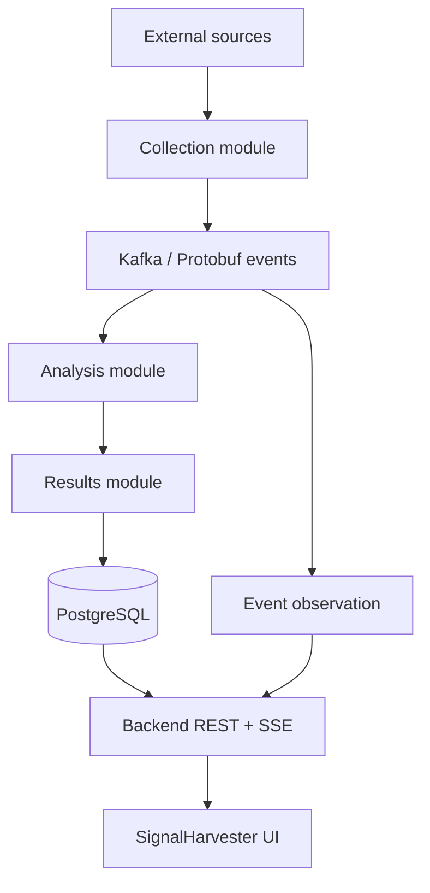

# SignalHarvester

SignalHarvester is a modular event-driven backend for collecting, analyzing, and presenting information from configurable external sources.

The first product focus is:

- job-vacancy monitoring;
- selected information-topic monitoring.

The backend is **modular monolith first**. One Micronaut application is assembled from cohesive Gradle modules with explicit Java and event contracts.

Kafka, PostgreSQL, Kubernetes, and observability remain first-class system components. They do not require every module to become a separately deployed service.

## System at a glance



Communication boundaries are explicit:

- Kafka events use versioned `.proto` files.
- Synchronous in-process module collaboration uses Java interfaces and Java types.
- Browser and test clients use REST/JSON.
- Browser live updates use SSE/JSON.

## Companion UI project

The web frontend is a separate repository named **`signalharvester-web`**. It owns the complete SignalHarvester Web application.

The current operational/admin screens are the first implemented frontend product slice. They are not a separate admin-only application.

This backend repository owns the public REST/OpenAPI and SSE contracts consumed by the UI. Frontend implementation details stay in the UI repository.

For frontend setup and run instructions, start with the UI repository root `README.md`. Frontend specifications belong in its own `docs/specs/` tree.

Backend [`docs/INSTALLATION.md`](docs/INSTALLATION.md) and [`docs/USAGE.md`](docs/USAGE.md) cover backend and infrastructure setup only.

## Start here

| Goal | Read |
|---|---|
| Repository development rules | [`AGENTS.md`](AGENTS.md) |
| Product/system target and active work | [`docs/specs/README.md`](docs/specs/README.md) |
| Stable feature vocabulary | [`docs/FEATURES.md`](docs/FEATURES.md) |
| Stable architecture boundaries | [`docs/ARCHITECTURE.md`](docs/ARCHITECTURE.md) |
| Current implementation state | [`docs/IMPLEMENTATION.md`](docs/IMPLEMENTATION.md) |
| Backend setup prerequisites | [`docs/INSTALLATION.md`](docs/INSTALLATION.md) |
| Backend usage/run workflows | [`docs/USAGE.md`](docs/USAGE.md) |
| Configuration ownership | [`docs/CONFIGURATION.md`](docs/CONFIGURATION.md) |
| Tests and validation | [`docs/TESTS.md`](docs/TESTS.md) |
| Coverage and code quality | [`docs/QUALITY.md`](docs/QUALITY.md) |
| Product/technical roadmap | [`docs/ROADMAP.md`](docs/ROADMAP.md) |

## Repository structure

```text
signalharvester/
├── app/                         # Micronaut composition root
├── common/                      # Small stable shared primitives/utilities
├── contracts/
│   ├── api-contracts/           # OpenAPI/REST contract sources
│   └── event-contracts/         # Kafka Protobuf contract sources
├── modules/
│   ├── configuration/
│   ├── collection/
│   ├── analysis/
│   ├── results/
│   ├── event-observation/
│   └── security/
├── testing/
│   ├── test-support/
│   └── integration-tests/
├── infra/
│   ├── docker-compose/
│   ├── kubernetes/
│   └── observability/
└── docs/
    └── specs/
```

Read [`modules/README.md`](modules/README.md) for functional-module ownership. Read [`contracts/README.md`](contracts/README.md) for REST and event-contract ownership.

## Current state

The implemented backend foundation includes the following capability groups.

### Runtime, contracts, and verification

- Runnable Micronaut composition root in `app`.
- Centralized dependency/plugin versions in `gradle/libs.versions.toml`.
- Micronaut Platform version exposed as Gradle property `micronautVersion`.
- Versioned Protobuf `EventEnvelope`, `RawItemDiscovered`, `ItemAnalyzed`, and `ItemRejected` schemas.
- JUnit contract tests plus PostgreSQL and Kafka Testcontainers coverage.
- Repository-level JaCoCo, SpotBugs, dependency-health reporting, and canonical verification workflows.

### Configuration and collection

- Configuration-module Java API with PostgreSQL/Flyway-backed Sources and Monitoring Profiles, including typed profile-owned Analysis settings.
- Source REST/OpenAPI CRUD under `/api/v1/sources`.
- Micronaut-managed collection HTTP transport with bounded Virtual Thread orchestration.
- Bounded RSS/Atom extraction.
- Configuration-driven REST/JSON and HTML extraction.
- Backward-compatible passthrough when generic extraction is not configured.
- Persisted-source diagnostic testing without Kafka publication or Collection Run history.
- Profile-driven Collection Runs with deterministic raw-item identity, run correlation, bounded best-effort fetch, and partial-failure outcomes.
- PostgreSQL interval scheduling with cluster-safe leases and lease heartbeats.

### Analysis and results

- Analysis consumption with deterministic normalization.
- PostgreSQL-backed profile-scoped deduplication.
- Deterministic keyword analysis driven by immutable Monitoring Profile settings snapshots carried in `RawItemDiscovered`.
- Manual source-offset commit after durable processing.
- Transactional-outbox staging of `ItemAnalyzed` and `ItemRejected`.
- Operational APIs for Collection Runs and bounded Analysis inspection.
- Results-owned PostgreSQL materialization with idempotent at-least-once consumption.
- Results REST browsing with bounded filters, indexed text search, opaque keyset continuation, and profile-scoped detail.
- Resumable Results SSE backed by durable PostgreSQL cursors and `Last-Event-ID`.

### Diagnostics, reliability, and observability

- Event Observation over published raw/analyzed/rejected Kafka events.
- Bounded diagnostic history with REST/SSE Event Explorer APIs.
- Collection-run and item Processing Flow reconstruction with explicit observed, derived, and unobserved evidence.
- Bounded Kafka retry and versioned dead-letter handling for Analysis, Results, and Event Observation.
- Verification-pending ADMIN-only owner-specific dead-letter inspection/replay that reuses the original key/payload without republishing shared source events.
- Health/readiness endpoints, Prometheus metrics, OpenTelemetry HTTP/Kafka/JDBC tracing, and trace-correlated console logs.
- Trace-context preservation across Collection fan-out and the Analysis outbox.

### Security and deployment

- Persisted application identities with additive `USER`, `VIEWER`, `ADMIN`, and `BOT` roles.
- Stateless JWT authentication.
- HttpOnly browser JWT cookie plus double-submit CSRF protection.
- Backend-enforced RBAC.
- Connection-bound external-source DNS authorization with redirect revalidation and explicit trusted-local compatibility.
- Accepted backend-owned Kubernetes deployment with PostgreSQL, Redpanda, Prometheus, Loki, Tempo, Grafana Alloy, kube-state-metrics, and Grafana.
- Accepted live resilience verification for restart, persistence outage, retry/DLQ, Kafka lag, outbox recovery, scheduler leases, authorization, and telemetry evidence.
- Accepted Kafka consumer horizontal scaling over the existing modular-monolith Deployment and three-partition local topics, with live backlog-drain verification from one to three replicas.

The default host-run local profile remains an explicitly trusted unauthenticated compatibility mode while the frontend is migrated.

The `security` environment enables authentication/RBAC and restrictive outbound-source policy.

`SCALABILITY.KAFKA_CONSUMERS` is accepted after live developer verification demonstrated partition-bounded backlog drain from one to three backend replicas. Profile-owned typed Analysis settings and production-oriented Results browsing are also accepted. The current verification-pending backend focus adds controlled ADMIN dead-letter recovery for `RELIABILITY.DEAD_LETTER`.

Full umbrella Kubernetes acceptance still requires a real `signalharvester-web` image from the companion repository. Repository-owned Docker Compose remains the lightweight local PostgreSQL/Kafka development path.

See [`docs/IMPLEMENTATION.md`](docs/IMPLEMENTATION.md) for detailed implemented state. See [`docs/USAGE.md`](docs/USAGE.md) for runnable workflows.

For local development infrastructure, defaults work without an env file:

```bash
docker compose -f infra/docker-compose/compose.yaml up -d
```

For local overrides:

1. copy `infra/docker-compose/.env.example` to `infra/docker-compose/.env`;
2. pass it explicitly with `--env-file`.

See [`infra/docker-compose/README.md`](infra/docker-compose/README.md).

## Documentation model

Managed documentation uses minimal YAML frontmatter: `type`, `title`, and `description`. Active specifications add workflow metadata defined by [`docs/specs/README.md`](docs/specs/README.md).

Stable capability names live in [`docs/FEATURES.md`](docs/FEATURES.md). Feature IDs are long-lived cross-references. Requirement IDs remain local to their specifications.

Current-state documentation and active specifications have different roles:

- active specifications define intended unresolved changes;
- architecture, implementation, configuration, installation, usage, testing, and quality documents describe accepted current state;
- completed implementation specifications move to the archive.

## License

See [`LICENSE.md`](LICENSE.md). No redistribution license is assumed unless that file is updated explicitly.
