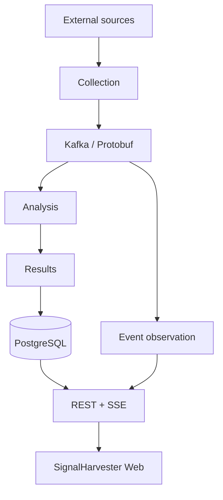

# SignalHarvester

SignalHarvester is a modular backend for monitoring configurable external data sources. It collects new items, moves them through an event-driven processing pipeline, analyzes and stores the results, and exposes them through REST and live SSE APIs.

The project is intentionally domain-neutral. Typical monitoring scenarios include:

- scientific publications and research data;
- news and topic-oriented information;
- financial, company, regulatory, and public-market data.

The current bounded backend implementation focus is verification of explicit all-relevant Analysis settings for Monitoring Profiles without keyword filtering.

SignalHarvester is also a practical engineering project for exploring **AI-assisted development** and **Spec-Driven Development**. The repository is organized around explicit specifications, small implementation slices, clear module contracts, repeatable verification, and post-implementation review. The goal is to develop the system while also testing how these practices scale on a realistic event-driven application.

The backend starts as a **modular monolith**: one Micronaut application assembled from cohesive Gradle modules. Modules own complete capabilities and communicate through explicit Java APIs or published event contracts. They can be split further when scaling, isolation, ownership, or deployment needs justify it.

## How data moves through the system



The main boundaries are:

- **Java interfaces** for synchronous calls between backend modules in the same JVM;
- **Kafka + Protocol Buffers** for asynchronous processing stages;
- **REST + JSON** for frontend, tooling, and external clients;
- **SSE + JSON** for live updates;
- **PostgreSQL** for durable application state owned by individual modules.

## How reliability works

SignalHarvester uses standard reliability patterns for event-driven systems: at-least-once delivery, bounded retries, dead-letter handling, transactional outbox, idempotent processing, lease-based ownership, and safe replay. The implementation favors explicit durable state and recovery boundaries over hidden runtime assumptions.

### Kafka delivery is intentionally at-least-once

Kafka consumers use synchronous per-record framework commits. A source offset becomes eligible for commit only after the module has reached a durable terminal outcome: for example, Analysis has committed its database transaction, Results has durably projected the event, or an acknowledged dead-letter record has been published.

If the framework cannot commit the offset after the application work succeeded, the source record may be delivered again. This is expected. Analysis deduplication, Results projection keys, and Event Observation event identity are designed so repeated delivery does not corrupt durable state.

Application retries are bounded and owned by the module. Deterministic poison records are sent to a versioned dead-letter event instead of being retried forever. If DLQ publication itself fails, the listener fails rather than pretending the source record completed successfully. Operator-controlled replay reads the original payload from the DLQ and sends it back through the owning module's normal application path without rewriting Kafka consumer offsets.

### Database changes and Kafka publication use a transactional outbox

Analysis uses a **transactional outbox** to coordinate PostgreSQL state changes with terminal Kafka publication without holding a database transaction across broker I/O. Outbox records keep a stable event identity, and downstream consumers are designed for safe retry and replay.

Detailed outbox invariants and failure semantics are documented in the Analysis contract and the architecture/implementation documentation.

### Leases coordinate multiple backend replicas

Scheduled collection and Analysis outbox dispatch both use short PostgreSQL leases. A lease has an exact token and an expiry time.

The token prevents an old replica from modifying state after another replica has taken ownership. The expiry prevents a stalled replica from keeping work forever. Recent reliability hardening also makes expiry a real fencing boundary: an expired owner cannot simply "come back" and renew or complete work using an old token.

For the Analysis outbox, a row must still have a live exact-token lease immediately before Kafka publication starts. If an unsuccessful send outlives that lease, the stale dispatcher is not allowed to push the row into a new retry-backoff window; the expired row remains available for immediate recovery by another replica.

For scheduled Collection Runs, an interrupted already-started run does not advance `next_due_at`. Its lease is allowed to expire, after which overdue work can be reclaimed safely.

### Shutdown and cancellation are not business failures

SignalHarvester uses blocking application code on Micronaut's blocking executor, which can use Java Virtual Threads. Thread interruption is therefore treated as a lifecycle cancellation signal, not as an ordinary source, broker, or business error.

When shutdown interrupts Kafka publication, source fetching, outbox dispatch, retry waiting, or other blocking work, the interrupt is propagated upward instead of being converted into a normal retry/DLQ/result status. This prevents a cancelled worker from accidentally marking unfinished work as successfully completed or from continuing with later work in the same batch.

SSE subscriptions follow the same principle. Disconnecting a client cancels future polling and requests interruption of an already-running blocking database poll. The reusable demand-driven polling lifecycle lives in the small `common` shared kernel; result/event cursor and SSE semantics remain owned by their functional modules.

### PostgreSQL ownership and transactions stay explicit

Each functional module owns its schema and migrations. Modules do not reach into each other's private tables. Application use cases own transaction boundaries, while Jdbi adapters participate in those transactions rather than silently creating independent commits.

Where duplicate execution is possible, durable identities, unique constraints, processed-event state, or exact-token lease checks provide the recovery fence. The system prefers repeatable work that is safe to replay over fragile assumptions that a network or process cannot fail at a particular instant.

For detailed invariants, see [`docs/ARCHITECTURE.md`](docs/ARCHITECTURE.md), [`docs/IMPLEMENTATION.md`](docs/IMPLEMENTATION.md), and the owning module `contract.md` files.

## Companion web application

The frontend lives in the separate **`signalharvester-web`** repository.

This repository owns backend behavior and the REST/OpenAPI and SSE contracts used by the UI. Frontend implementation details and frontend specifications remain in the frontend repository.

Backend [`docs/INSTALLATION.md`](docs/INSTALLATION.md) and [`docs/USAGE.md`](docs/USAGE.md) cover backend and infrastructure workflows only.

## Start here

| Goal | Read |
|---|---|
| Development rules | [`AGENTS.md`](AGENTS.md) |
| Active specification and current work | [`docs/specs/README.md`](docs/specs/README.md) |
| Stable feature vocabulary | [`docs/FEATURES.md`](docs/FEATURES.md) |
| Architecture and module boundaries | [`docs/ARCHITECTURE.md`](docs/ARCHITECTURE.md) |
| Current implementation details | [`docs/IMPLEMENTATION.md`](docs/IMPLEMENTATION.md) |
| Backend setup | [`docs/INSTALLATION.md`](docs/INSTALLATION.md) |
| Running and using the backend | [`docs/USAGE.md`](docs/USAGE.md) |
| Configuration | [`docs/CONFIGURATION.md`](docs/CONFIGURATION.md) |
| Tests and validation | [`docs/TESTS.md`](docs/TESTS.md) |
| Coverage and code quality | [`docs/QUALITY.md`](docs/QUALITY.md) |
| Roadmap | [`docs/ROADMAP.md`](docs/ROADMAP.md) |
| Change history | [`CHANGELOG.md`](CHANGELOG.md) |

## Repository structure

```text
signalharvester/
├── app/                         # Micronaut composition root
├── common/                      # Small stable shared primitives
├── contracts/
│   ├── api-contracts/           # OpenAPI/REST contract sources
│   └── event-contracts/         # Kafka Protobuf contract sources
├── modules/
│   ├── configuration/
│   ├── collection/
│   ├── analysis/
│   ├── results/
│   ├── event-observation/
│   └── security/
├── testing/
│   ├── test-support/
│   └── integration-tests/
├── infra/
│   ├── docker-compose/
│   ├── kubernetes/
│   └── observability/
└── docs/
    └── specs/
```

[`modules/README.md`](modules/README.md) explains functional-module ownership. [`contracts/README.md`](contracts/README.md) explains REST and event-contract ownership.

## What is implemented today

The backend covers the core pipeline from configuration and collection through analysis, persistence, diagnostics, and live results.

### Configuration and collection

- PostgreSQL-backed Sources and Monitoring Profiles.
- Typed, profile-owned Analysis settings, including an explicit all-relevant state when no keyword filter is configured.
- Source CRUD and persisted-source diagnostic testing.
- RSS/Atom, REST/JSON, and HTML extraction paths.
- Manual and scheduled profile-driven Collection Runs.
- Bounded concurrent source fetching on blocking/Virtual-Thread execution.
- Durable run history and cluster-safe scheduler leases.

### Analysis and results

- Versioned Protobuf events for discovered, analyzed, rejected, and dead-letter records.
- Deterministic normalization and profile-scoped deduplication.
- Deterministic Analysis from immutable settings snapshots carried with collected events, with either opt-in keyword filtering or explicit all-relevant classification.
- Transactional Analysis outbox publication.
- Idempotent Results materialization in PostgreSQL.
- Results REST browsing with filters, indexed text search, and opaque keyset continuation.
- Resumable Results SSE using durable database cursors and `Last-Event-ID`.

### Diagnostics and operations

- Event Observation for raw/analyzed/rejected Kafka events.
- Processing Flow reconstruction for collection runs and individual items.
- ADMIN-only dead-letter inspection and controlled replay.
- Operational Collection Run and Analysis inspection APIs.
- Health/readiness endpoints, Prometheus metrics, OpenTelemetry tracing, and trace-correlated logs.

### Security and deployment

- Persisted identities with `USER`, `VIEWER`, `ADMIN`, and `BOT` roles.
- Stateless JWT authentication and backend-enforced RBAC.
- HttpOnly browser JWT cookie with double-submit CSRF protection.
- External-source destination authorization with DNS/redirect revalidation.
- Backend-owned Kubernetes deployment with PostgreSQL, Redpanda, Prometheus, Loki, Tempo, Grafana Alloy, kube-state-metrics, and Grafana.
- Live resilience verification for restart, persistence outage, Kafka lag, retry/DLQ, outbox recovery, scheduler leases, authorization, telemetry, and one-to-three replica Kafka consumer scaling.

The default host-run local profile is an explicitly trusted unauthenticated compatibility mode. The `security` environment enables authentication/RBAC and the restrictive outbound-source policy.

For detailed accepted state, use [`docs/IMPLEMENTATION.md`](docs/IMPLEMENTATION.md). For current and upcoming work, use [`docs/ROADMAP.md`](docs/ROADMAP.md). Historical implementation slices belong in [`docs/specs/archive/`](docs/specs/archive/), not in this overview.

## Run local infrastructure

The default Docker Compose setup starts PostgreSQL and a Kafka-compatible Redpanda broker:

```bash
docker compose -f infra/docker-compose/compose.yaml up -d
```

For local overrides:

1. copy `infra/docker-compose/.env.example` to `infra/docker-compose/.env`;
2. pass it explicitly with `--env-file`.

See [`infra/docker-compose/README.md`](infra/docker-compose/README.md) for details.

## Code structure

The backend follows a **functional modular-monolith** structure. Each module owns a capability end to end: its application logic, persistence, adapters, integration points, tests, and public boundary. The repository keeps decomposing capabilities into modules when that makes ownership or dependencies clearer, without splitting code mechanically or introducing service boundaries without a concrete reason.

Every functional module has an authoritative `contract.md`. Cross-module synchronous Java APIs live in explicit `api` packages, while REST/OpenAPI and Kafka/Protobuf contracts live under `contracts/`. Private persistence and implementation packages stay module-local.

These boundaries are useful both for normal development and for AI-assisted work. A module can often be understood from its contract and public API without loading its private implementation. This keeps model context focused on the relevant capability and reduces unrelated repository detail during analysis or implementation work.

The small `common` module is reserved for genuinely generic, stable primitives that do not belong to a functional module. Shared code is moved there only when the boundary is clear and reuse is established.

## Documentation model

SignalHarvester documentation is organized to support a **Spec-Driven Development** workflow without turning specifications into a second copy of the implementation.

- Active specifications describe bounded intended changes and their acceptance criteria.
- Accepted behavior belongs in current-state architecture, implementation, configuration, usage, testing, and module documentation.
- Completed implementation specifications move to the archive and become historical context.

Managed documentation uses **Open Knowledge Format (OKF)** metadata headers, represented as YAML frontmatter. Common fields such as `type`, `title`, and `description` make documents easier to identify and navigate; specifications add lifecycle metadata where needed.

Stable capability identifiers are defined in [`docs/FEATURES.md`](docs/FEATURES.md). Feature IDs such as `ANALYSIS.OUTBOX` provide a shared vocabulary for cross-references between specifications, current-state documentation, tests, and important implementation entry points without coupling those references to class names or temporary implementation stages.

Development rules live in [`AGENTS.md`](AGENTS.md) and the nearest local `AGENTS.md`. Specification lifecycle and structure are documented in [`docs/specs/README.md`](docs/specs/README.md).

## License

See [`LICENSE.md`](LICENSE.md). No redistribution license is assumed unless that file is updated explicitly.
