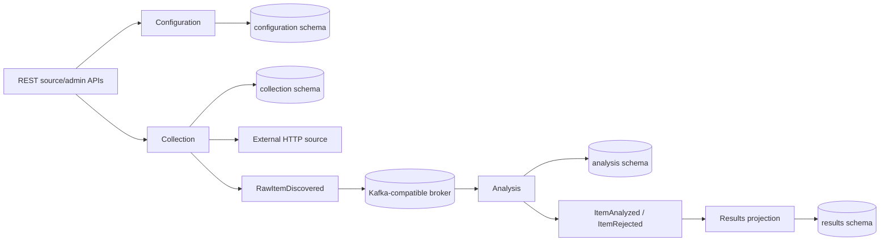

# SignalHarvester implementation guide

## Purpose and ownership

This document describes the accepted **system-level current implementation**: what is assembled, how implemented modules interact, and which infrastructure/contracts are active. Detailed module internals belong in each module's `README.md` and `contract.md`; test inventory and commands belong in [`TESTS.md`](TESTS.md). Planned behavior remains in active specifications.

## Build and runtime foundation

SignalHarvester is a Java 21 Gradle multi-project modular monolith with one runnable Micronaut application.

Dependency and plugin versions are centralized in `gradle/libs.versions.toml`; the Micronaut Platform version is exposed through `gradle.properties` as `micronautVersion` for the Micronaut Gradle plugins. The current baseline pins:

- Micronaut Gradle plugin 4.6.2;
- Micronaut Framework 4.10.15;
- Protocol Buffers 4.36.1;
- JUnit 5.14.4;
- Testcontainers 2.0.5.

`app/src/main/java/io/signalharvester/Application.java` is the executable composition root. The application uses the Netty runtime, HTTP port `SIGNALHARVESTER_HTTP_PORT` (default `8080`), and a Virtual-Thread-backed Micronaut blocking executor on the Java 21 baseline.

All currently implemented REST controllers are blocking adapters and use `@ExecuteOn(TaskExecutors.BLOCKING)` for JDBC and synchronous collection work. Future true streaming endpoints such as SSE remain reactive rather than being moved to the blocking executor mechanically.

## Current implemented flow



Terminal analysis events are materialized by `modules:results` and exposed through the bounded public `/api/v1/results` read API.

## Configuration module

`modules:configuration` owns persisted source configuration and the `/api/v1/sources` REST implementation.

Its published synchronous Java surface is deliberately narrow: `io.signalharvester.configuration.api.SourceConfigurationProvider` plus the effective configuration types required by that provider. Configuration administration remains an internal application boundary used by the module-owned HTTP adapter.

`SourceConfigurationManager` implements both the internal administration boundary and the published provider contract. PostgreSQL schema `configuration` is created by `db/migration/configuration/V1__create_source_configuration.sql`; writes are transaction-owned by the application use case while JDBC SQL/resource handling stays in persistence adapters.

See [`../modules/configuration/README.md`](../modules/configuration/README.md) and [`../modules/configuration/contract.md`](../modules/configuration/contract.md) for module-local detail.

## Collection module

`modules:collection` owns bounded external-source fetching, explicit collection-run execution, deterministic raw-item identity, `RawItemDiscovered` publication, durable completed-run history, and `/api/v1/admin/collection-runs`.

Collection currently publishes no synchronous cross-module Java API. `CollectionRunner`, `CollectionRunHistory`, and their run/result models are internal `collection.run` application boundaries used by collection-owned adapters and tests. Collection reads enabled sources only through `configuration.api`; the Gradle dependency on configuration is therefore an `implementation` dependency.

External HTTP access and Kafka publication remain internal module ports. The generic HTTP path uses Micronaut-managed low-level absolute-URI requests with explicit time, response-size, redirect, connection-pool, and concurrency bounds. Fetch completion is pipelined into terminal publication with backpressure: only the bounded in-flight window may retain raw payload bodies, while final per-source results are reconstructed in configured-source order. Source-level fetch/publication failures are best-effort terminal outcomes and do not cancel unrelated source work.

Successful source payloads are published as versioned `RawItemDiscovered` Protobuf bytes. The collection run id is reused as the event correlation id, while raw-item identity is deterministic over source id, requested URI, and raw payload.

PostgreSQL schema `collection` is created by `db/migration/collection/V3__create_collection_run_history.sql` and stores completed runs plus ordered per-source outcomes for operational inspection.

See [`../modules/collection/README.md`](../modules/collection/README.md) and [`../modules/collection/contract.md`](../modules/collection/contract.md) for module-local detail.

## Analysis module

`modules:analysis` consumes `RawItemDiscovered`, maps transport messages into module-owned models, normalizes content, performs monitoring-profile-scoped durable deduplication, applies deterministic keyword analysis, and publishes terminal `ItemAnalyzed` or `ItemRejected` events.

The raw-item processing path is intentionally event-driven and remains internal. Analysis currently publishes no synchronous cross-module Java API; the bounded `AnalysisItemInspectionQuery` is an internal application boundary used by the analysis-owned `/api/v1/admin/analysis/items` adapter.

PostgreSQL schema `analysis` is created by `db/migration/analysis/V2__create_normalized_item_claims.sql`. Logical normalized identity excludes monitoring profile id; duplicate claims are scoped by `(monitoringProfileId, normalizedItemId)`.

The listener disables automatic offset commit and commits the raw Kafka offset only after application processing and terminal publication return successfully. Deduplication persistence uses the transaction-aware JDBC connection owned by `RawItemProcessingService`; failed analyzed/rejected publication rolls back the corresponding claim/counter update and leaves the consumed input offset uncommitted. This is **not** distributed exactly-once behavior. An acknowledged output followed by database commit failure can still be published again after redelivery, so future results persistence must be idempotent until an outbox or equivalent stronger cross-resource strategy is introduced.

See [`../modules/analysis/README.md`](../modules/analysis/README.md) and [`../modules/analysis/contract.md`](../modules/analysis/contract.md) for module-local detail.

## Results module

`modules:results` consumes terminal `ItemAnalyzed` and `ItemRejected` events and materializes them into the module-owned PostgreSQL `results` schema. Generated Protobuf messages are confined to the Kafka adapter and mapped into immutable Results-owned models before application/persistence logic.

`ResultProjectionService` owns the JDBC transaction. `JdbcResultProjectionRepository` uses the transaction-aware default connection and upserts analyzed projections by `(monitoringProfileId, normalizedItemId)`. Tags and attributes are replaced atomically with the parent projection. Rejections are keyed by `sourceEventId`, so retry of one raw source event does not create another rejection row while later rediscovery events remain separate.

The Results listener disables automatic Kafka commit and commits the consumed offset only after the Results transaction completes. This is an at-least-once/idempotent-consumer model, not distributed exactly-once processing.

`ResultQueryService` owns short read-only JDBC transactions for the public Results API. `GET /api/v1/results` exposes a bounded recent-result feed with profile/source/category/relevance/classification/time filters without returning large normalized content, while `GET /api/v1/results/{normalizedItemId}?monitoringProfileId=...` returns the detailed content, attributes, tags, and provenance for one profile-scoped logical result. SSE/live delivery remains pending.

See [`../modules/results/README.md`](../modules/results/README.md) and [`../modules/results/contract.md`](../modules/results/contract.md).

## Event observation

`modules:event-observation` still contains only its module/build skeleton and boundary contract. Durable event observation and Event Explorer backend support are not implemented. See [`../modules/event-observation/contract.md`](../modules/event-observation/contract.md).

## External contracts

The authoritative REST contract is [`../contracts/api-contracts/src/main/resources/openapi/signalharvester-v1.yaml`](../contracts/api-contracts/src/main/resources/openapi/signalharvester-v1.yaml). It currently describes source CRUD, manual collection-run/history operations, analysis inspection, and public Results browsing/detail queries.

The authoritative Kafka schemas are versioned `.proto` files under `contracts/event-contracts/src/main/proto/`:

```text
common/v1/event-envelope.proto
collection/v1/raw-item-discovered.proto
analysis/v1/item-analyzed.proto
analysis/v1/item-rejected.proto
```

Generated Protobuf Java classes are build output and remain transport types at Kafka adapter boundaries.

## Persistence and Flyway

Configuration, analysis, collection, and results currently share one physical datasource and one Flyway schema history while retaining module-owned PostgreSQL schemas/tables. Their migration locations are all configured in `app/src/main/resources/application.properties`.

Because the Flyway history is shared, migration versions are globally coordinated across module locations (`V1` configuration, `V2` analysis, `V3` collection, `V4` results, and so on) unless the Flyway topology is deliberately changed later.

Direct cross-module table access remains forbidden.

## Testing implementation

The root Gradle build separates fast/default tests from integration tests through distinct source sets:

- `./gradlew test` runs only regular `src/test` unit/behavior/contract tests;
- `./gradlew integrationTest` runs dedicated `src/integrationTest` scenarios, including Testcontainers and cross-module flows.

The separation is structural rather than tag-based, so a correctly placed integration test cannot accidentally execute as part of the default `test` lifecycle.

Architecture enforcement includes `ModuleBoundaryArchitectureTest`, which rejects production dependencies from one functional module to another module outside the providing module's `api..` package.

See [`TESTS.md`](TESTS.md) for the authoritative test inventory, infrastructure requirements, and focused commands.

## Local infrastructure

`infra/docker-compose/compose.yaml` provides repository-owned local PostgreSQL and a single-node Redpanda broker exposing a Kafka-compatible API. Redpanda runs in local development mode with topic auto-creation; Kubernetes and production observability configuration are not implemented yet.

See [`../infra/docker-compose/README.md`](../infra/docker-compose/README.md) for the current local lifecycle and endpoints.

## Known limitations

- no source parsing/extraction into multiple external items;
- no persisted monitoring profiles, profile-to-source membership, or scheduling;
- no result SSE/live-update API;
- no cursor/full-text result search beyond bounded REST filters;
- no outbound SSRF/network-destination policy; source management must remain trusted until one is defined;
- no event-observation persistence/API;
- no OpenTelemetry instrumentation;
- no Kubernetes deployment or production observability stack;
- no cross-resource exactly-once guarantee between PostgreSQL and Kafka;
- no bounded retry/DLQ policy for poison Analysis or Results input events.
