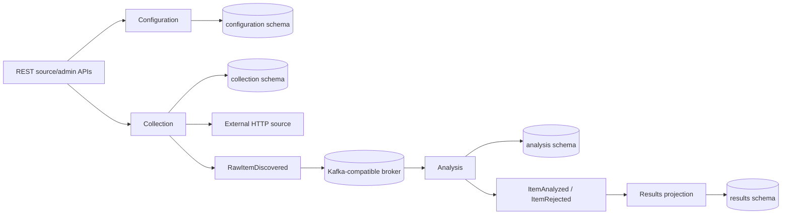

# SignalHarvester implementation guide

## Purpose and ownership

This document describes the accepted **system-level current implementation**: what is assembled, how implemented modules interact, and which infrastructure/contracts are active. Detailed module internals belong in each module's `README.md` and `contract.md`; test inventory and commands belong in [`TESTS.md`](TESTS.md). Planned behavior remains in active specifications.

## Build and runtime foundation

SignalHarvester is a Java 21 Gradle multi-project modular monolith with one runnable Micronaut application.

Dependency and plugin versions are centralized in `gradle/libs.versions.toml`; the Micronaut Platform version is exposed through `gradle.properties` as `micronautVersion` for the Micronaut Gradle plugins. The current baseline pins:

- Micronaut Gradle plugin 4.6.2;
- Micronaut Framework 4.10.15;
- Protocol Buffers 4.36.1;
- JUnit 5.14.4;
- Testcontainers 2.0.5.

`app/src/main/java/io/signalharvester/Application.java` is the executable composition root. The application uses the Netty runtime, HTTP port `SIGNALHARVESTER_HTTP_PORT` (default `8080`), and a Virtual-Thread-backed Micronaut blocking executor on the Java 21 baseline.

Synchronous REST controllers that invoke JDBC or blocking collection work use `@ExecuteOn(TaskExecutors.BLOCKING)`. The Results and Event Observation SSE controllers are true streaming `Publisher` boundaries and therefore remain reactive; their PostgreSQL polling is submitted explicitly to the blocking executor rather than running JDBC on the Netty event loop.

## Current implemented flow



Terminal analysis events are materialized by `modules:results` and exposed through the bounded public `/api/v1/results` REST API plus `/api/v1/results/stream` SSE live delivery.

## Configuration module

`modules:configuration` owns persisted source and monitoring-profile configuration plus their REST implementations.

Its published synchronous Java surface is deliberately narrow: `io.signalharvester.configuration.api.SourceConfigurationProvider` and `MonitoringProfileConfigurationProvider` plus the effective configuration types required by those providers. Configuration administration remains an internal application boundary used by the module-owned HTTP adapters.

`SourceConfigurationManager` implements both the internal administration boundary and the published provider contract. PostgreSQL schema `configuration` is created by `db/migration/configuration/V1__create_source_configuration.sql`; writes are transaction-owned by the application use case while JDBC SQL/resource handling stays in persistence adapters.

See [`../modules/configuration/README.md`](../modules/configuration/README.md) and [`../modules/configuration/contract.md`](../modules/configuration/contract.md) for module-local detail.

## Collection module

`modules:collection` owns bounded external-source fetching, source-type extraction, persisted-source diagnostic testing, profile-driven collection-run execution, interval scheduling, deterministic raw-item identity, `RawItemDiscovered` publication, durable completed-run history, `/api/v1/sources/{sourceId}/test`, and `/api/v1/admin/collection-runs`.

Collection currently publishes no synchronous cross-module Java API. `CollectionRunner`, `CollectionRunHistory`, and their run/result models are internal `collection.run` application boundaries used by collection-owned adapters, scheduling, and tests. Collection resolves monitoring profiles and source configuration only through `configuration.api`; the Gradle dependency on configuration is therefore an `implementation` dependency. Manual collection requests provide only the persisted monitoring-profile UUID. The profile supplies information category and ordered source membership; disabled member sources are skipped.

External HTTP access and Kafka publication remain internal module ports. The generic HTTP path uses Micronaut-managed low-level absolute-URI requests with explicit time, response-size, redirect, connection-pool, and concurrency bounds. Fetch completion is pipelined into terminal publication with backpressure: only the bounded in-flight window may retain raw payload bodies, while final per-source results are reconstructed in configured-source order. Source-level fetch/publication failures are best-effort terminal outcomes and do not cancel unrelated source work.

RSS/Atom responses produce one semantic item per bounded feed entry. REST sources with `json.*` settings use RFC 6901 JSON Pointer extraction, and HTML sources with `html.*` settings use jsoup CSS selectors. REST/HTML sources without those settings preserve the original one-response passthrough behavior. Extracted metadata populates the existing `RawItemDiscovered` external id, title, URL, content, content type, and publication time fields. The collection run id is reused as the event correlation id. Passthrough raw identity preserves the original source-id + URI + raw-body behavior, while RSS/Atom and configuration-driven JSON/HTML extraction use deterministic per-item semantic identity material.

Diagnostic source testing loads a persisted source through `SourceConfigurationProvider` and calls the same `ExternalSourceClient` and `SourceItemExtractor` used by collection runs. It intentionally stops before raw-item identity/publication and run-history persistence. The response reports bounded fetch/extraction diagnostics and preview items; a disabled source can therefore be tested before activation.

PostgreSQL schema `collection` is created by `db/migration/collection/V3__create_collection_run_history.sql`; `V5__expand_collection_run_source_statuses.sql` adds feed extraction statuses and `V7__create_monitoring_profile_schedule_state.sql` adds collection-owned scheduler state. Scheduling polls enabled profiles and uses short transactional PostgreSQL claims with renewable lease tokens. External fetch/Kafka work runs outside the claim transaction. A profile is first due one configured interval after it is observed, and completion schedules the next run from terminal completion.

See [`../modules/collection/README.md`](../modules/collection/README.md) and [`../modules/collection/contract.md`](../modules/collection/contract.md) for module-local detail.

## Analysis module

`modules:analysis` consumes `RawItemDiscovered`, maps transport messages into module-owned models, normalizes content, performs monitoring-profile-scoped durable deduplication, applies deterministic keyword analysis, and publishes terminal `ItemAnalyzed` or `ItemRejected` events.

The raw-item processing path is intentionally event-driven and remains internal. Analysis currently publishes no synchronous cross-module Java API; the bounded `AnalysisItemInspectionQuery` is an internal application boundary used by the analysis-owned `/api/v1/admin/analysis/items` adapter.

PostgreSQL schema `analysis` is created by `db/migration/analysis/V2__create_normalized_item_claims.sql`. `V10__create_analysis_event_outbox.sql` adds the Analysis transactional outbox. Logical normalized identity excludes monitoring profile id; duplicate claims are scoped by `(monitoringProfileId, normalizedItemId)`.

The listener disables automatic offset commit. Transport/key/mapping failures are dead-lettered immediately; application failures use bounded retry. After retry exhaustion, the original input, a deterministic source-position-based dead-letter identity, and failure metadata are published as `failure/v1/DeadLetterEvent`. The raw offset advances only after successful application processing or acknowledged dead-letter publication; a DLQ publication failure remains uncommitted. Successful application processing now means the deduplication state and exact serialized terminal Analysis event have committed atomically to PostgreSQL. `RawItemProcessingService` owns that transaction and `TransactionalAnalysisOutbox` appends the final topic/key/payload/event identity before commit.

`AnalysisOutboxDispatcher` claims bounded pending batches with short PostgreSQL leases, publishes the stored bytes to Kafka outside a database transaction, and records success or retry state in a second short transaction. Multiple replicas coordinate with `FOR UPDATE SKIP LOCKED` plus lease expiry. A crash after Kafka acknowledgement but before `published_at` may republish the same stored event, so delivery remains at-least-once; however the event id, key, topic, and payload remain stable and existing downstream idempotency handles that replay. The previous Kafka-ack/PostgreSQL-commit gap for Analysis authoritative state is removed without introducing distributed transactions.

See [`../modules/analysis/README.md`](../modules/analysis/README.md) and [`../modules/analysis/contract.md`](../modules/analysis/contract.md) for module-local detail.

## External-source access security

`SECURITY.EXTERNAL_SOURCE_ACCESS` is accepted. Collection owns runtime destination authorization through a named Netty address resolver used by the managed HTTP client. The resolver authorizes the exact DNS address set handed to the connection path, rejects mixed safe/unsafe answers in secure mode, reapplies the same policy to redirect destinations, and keeps an explicit `TRUSTED_LOCAL` mode for deterministic loopback fixtures. Configuration continues to validate URI syntax only; live network authorization remains in Collection. The `security` environment selects secure mode.

## Kubernetes and infrastructure observability

The repository now contains `app/Dockerfile` plus `infra/kubernetes/` assets for the backend-owned production-style local deployment slice. The backend image is built from the Gradle application distribution and runs as a non-root Java 21 process. Kubernetes runs two backend replicas against PostgreSQL and single-node Redpanda, uses the accepted `security` environment, creates runtime secrets outside source control, provisions current Kafka/DLQ topics explicitly, and uses the existing health/readiness endpoints as probes.

The same Kustomize target deploys Prometheus, Loki, Tempo, Grafana Alloy, kube-state-metrics, and Grafana. Prometheus scrapes backend, Redpanda, and Kubernetes workload-state metrics. The backend exports OTLP traces to Tempo; Tempo generates span metrics and remote-writes them to Prometheus. Alloy collects namespace pod logs into Loki. Grafana starts with Prometheus/Loki/Tempo data sources plus a repository-owned operational dashboard. This backend-owned slice is accepted after developer live Kubernetes verification. The separate frontend repository still owns its image; `infra/kubernetes/frontend/` defines only the expected runtime workload boundary, so full umbrella R24 is not yet accepted.

`infra/kubernetes/resilience/` provides the accepted live resilience acceptance layer over the deployed stack. It deploys an opt-in deterministic RSS fixture, temporarily allows only that Service address through the accepted outbound-source CIDR override, and runs controlled restart/failure scenarios through public REST plus operator-level Kubernetes/Kafka/PostgreSQL fault injection. The harness covers backend container restart with an existing JWT, slow-source availability, PostgreSQL outage with retry exhaustion and Analysis DLQ publication, observable Analysis consumer lag and recovery, outbox recovery across rollout, one scheduled run under two replicas, Redpanda restart recovery, and Loki/Tempo/Prometheus evidence. No production Java endpoint or wire contract is added for the harness.

## Kafka consumer horizontal scaling

`SCALABILITY.KAFKA_CONSUMERS` uses the existing single backend Deployment rather than separately deployed Java modules. Analysis, Results, and Event Observation listeners retain stable shared Kafka consumer groups, and the local application topics have three partitions. The opt-in `infra/kubernetes/scaling/run_acceptance.py` workflow creates a bounded unique-item backlog, establishes one Analysis worker with positive lag, scales the backend to three replicas, verifies active consumer membership and raw partition assignment, waits for lag drain without manual offset changes, and checks durable Analysis/Results completeness, outbox completion, DLQ stability, and HTTP availability. This stage is implementation-complete and verification-pending.

## Results module

`modules:results` consumes terminal `ItemAnalyzed` and `ItemRejected` events and materializes them into the module-owned PostgreSQL `results` schema. Generated Protobuf messages are confined to the Kafka adapter and mapped into immutable Results-owned models before application/persistence logic.

`ResultProjectionService` owns the JDBC transaction. `JdbcResultProjectionRepository` uses the transaction-aware default connection and upserts analyzed projections by `(monitoringProfileId, normalizedItemId)`. Tags and attributes are replaced atomically with the parent projection. Rejections are keyed by `sourceEventId`, so retry of one raw source event does not create another rejection row while later rediscovery events remain separate.

The Results listener disables automatic Kafka commit. Deterministic transport/key/mapping failures go directly to the Results DLQ; projection failures retry within the configured bound. The consumed offset advances only after the Results transaction completes or the terminal `DeadLetterEvent` is acknowledged. This remains an at-least-once/idempotent-consumer model, not distributed exactly-once processing.

`ResultQueryService` owns short read-only JDBC transactions for the public Results REST API. `GET /api/v1/results` exposes a bounded recent-result feed with profile/source/category/relevance/classification/time filters without returning large normalized content, while `GET /api/v1/results/{normalizedItemId}?monitoringProfileId=...` returns the detailed content, attributes, tags, and provenance for one profile-scoped logical result.

`GET /api/v1/results/stream` exposes Results-owned Server-Sent Events. `V8` adds one durable live cursor per current logical result. The cursor advances transactionally when a new `analysisEventId` updates the projection and remains unchanged for redelivery of the same analysis event. Fresh SSE connections receive a `ready` cursor and then later changes; browser reconnection resumes from `Last-Event-ID`. The cursor table stores current projections rather than an append-only update history, so disconnected updates to one logical result may collapse to the latest projection. Resume cursors ahead of current durable state are normalized to the current watermark. JDBC polling runs on the blocking executor while the controller remains a streaming `Publisher` boundary. Because the cursor table is shared PostgreSQL state, the Kafka consumer and SSE client may be served by different backend replicas.

See [`../modules/results/README.md`](../modules/results/README.md) and [`../modules/results/contract.md`](../modules/results/contract.md).

## Event observation

`modules:event-observation` consumes the published `RawItemDiscovered`, `ItemAnalyzed`, and `ItemRejected` topics through its own Kafka consumer group. Generated Protobuf messages remain confined to the Kafka adapter and are decoded into an observation-owned diagnostic model before persistence.

The Event Observation listener applies the same bounded retry and dead-letter policy: deterministic decode/key/mapping failures are terminal immediately, recording failures retry, and source offsets advance only after recording or acknowledged DLQ publication.

PostgreSQL schema `event_observation` is created by `V9__create_event_observation_history.sql`. `observed_events` stores event/envelope identity, Kafka topic/partition/offset/key, correlation and trace metadata, source/profile/item provenance, and selected human-readable payload diagnostics. Large raw/normalized content bodies are intentionally excluded. Event identity is unique, so Kafka redelivery is idempotent. Retention is enforced by configurable maximum age and maximum row count in the same application transaction as recording.

`GET /api/v1/events` exposes bounded technical history filters. `GET /api/v1/events/stream` exposes durable `ready`, `event`, and `keepalive` SSE cursors with `Last-Event-ID` resume. `GET /api/v1/flows/collection-runs/{collectionRunId}` and the run-scoped item variant reconstruct deterministic processing graphs on read from retained observation rows. Flow nodes state whether evidence is directly observed, derived from current event semantics, or not observed. Raw-to-terminal branches use the published terminal `sourceEventId`, so repeated logical content remains separated by discovery event. Results persistence is currently represented as an expected `NOT_OBSERVED` stage rather than being claimed as completed. Observation state and reconstructed graphs are diagnostic materialization only and are not authoritative for business modules.

See [`../modules/event-observation/README.md`](../modules/event-observation/README.md) and [`../modules/event-observation/contract.md`](../modules/event-observation/contract.md).

## External contracts

The authoritative REST contract is [`../contracts/api-contracts/src/main/resources/openapi/signalharvester-v1.yaml`](../contracts/api-contracts/src/main/resources/openapi/signalharvester-v1.yaml). It currently describes source and monitoring-profile CRUD, diagnostic persisted-source testing, profile-driven manual collection-run/history operations, analysis inspection, public Results browsing/detail queries and resumable Results SSE delivery, plus bounded Event Explorer history, live technical-event SSE, and reconstructed processing-flow graphs.

The authoritative Kafka schemas are versioned `.proto` files under `contracts/event-contracts/src/main/proto/`:

```text
common/v1/event-envelope.proto
collection/v1/raw-item-discovered.proto
analysis/v1/item-analyzed.proto
analysis/v1/item-rejected.proto
failure/v1/dead-letter-event.proto
```

Generated Protobuf Java classes are build output and remain transport types at Kafka adapter boundaries.

## Persistence and Flyway

Configuration, analysis, collection, results, event observation, and security currently share one physical datasource and one Flyway schema history while retaining module-owned PostgreSQL schemas/tables. Their migration locations are all configured in `app/src/main/resources/application.properties`.

Because the Flyway history is shared, migration versions are globally coordinated across module locations (`V1` configuration, `V2` analysis, `V3` collection, `V4` results, `V5` collection extraction status expansion, `V6` configuration profiles, `V7` collection scheduling, `V8` Results live cursors, `V9` event-observation history, `V10` Analysis event outbox, `V11` Analysis outbox trace context, and `V12` security identities/roles) unless the Flyway topology is deliberately changed later.

Direct cross-module table access remains forbidden.

## Authentication and authorization

`modules/security` implements the accepted backend security slice. It persists identities and explicit roles in the `security` PostgreSQL schema, hashes local passwords with salted PBKDF2-HMAC-SHA256, authenticates through a blocking Micronaut Security provider, and exposes current-principal plus ADMIN-only user-management HTTP APIs. `HUMAN` accounts always include `USER`; `BOT` accounts always include `BOT`; `VIEWER` and `ADMIN` remain independent additive roles.

The runnable application keeps security disabled in the default trusted local environment. Activating the `security` Micronaut environment enables short-lived signed JWT authentication, HttpOnly browser cookies, bearer-token validation, signed double-submit CSRF, explicit credentialed CORS configuration, and the cross-module endpoint/role matrix. Results REST/SSE require `VIEWER`; existing configuration, operations, and diagnostics require `ADMIN`. Health/Prometheus remain anonymously reachable in this local deployment slice. Authentication outcomes, administrative identity changes, and 401/403 API rejections are logged without credential or token contents.

No login/session table exists. Disabling an account blocks future credential authentication, while already-issued JWTs remain valid until their short expiry. Administrative updates cannot disable or demote the last enabled `ADMIN`; the persistence boundary serializes these updates before evaluating the invariant. The first administrator can be created from deployment-provided bootstrap credentials only when no enabled ADMIN exists; repository-known default administrator credentials are intentionally absent.

## External-source access security

Collection contains a verification-pending runtime destination policy for configurable HTTP sources. The Micronaut Netty client uses the named `signalharvester-external-source-access` `AddressResolverGroup`, which resolves hostnames off the Netty event loop on Java 21 Virtual Threads, authorizes the complete DNS answer set, and returns only an authorized socket address to the connection path. Because redirects create subsequent client destinations through the same resolver, cross-host redirects are revalidated before connection. Already-resolved literal IP destinations are forced through the same policy path.

The default trusted-local mode permits loopback/private destinations for deterministic development fixtures while still rejecting unspecified and multicast destinations. The `security` environment switches to `SECURE`, which blocks loopback, link-local, IPv4 private/site-local, and IPv6 unique-local destinations unless an operator explicitly authorizes the required network with `SIGNALHARVESTER_COLLECTION_OUTBOUND_ALLOWED_CIDRS`. Mixed DNS answers are rejected as a set rather than falling back to an unchecked address. Policy rejection maps to the existing source-fetch failure boundary, so Source Test reports `FETCH_FAILED` and Collection Runs isolate the failed source without Kafka publication or cancellation of unrelated sources.

## Application observability

The application composition root includes Micronaut management, Micrometer Prometheus, and OpenTelemetry instrumentation. It exposes `/health`, `/health/liveness`, `/health/readiness`, and `/prometheus`. Trace export defaults to `none`; configuring the OTLP exporter enables external trace collection without changing module behavior.

Collection records low-cardinality run/source-fetch metrics and creates one application span per manual or scheduled run. Its custom Virtual-Thread fetch fan-out wraps submitted work with Micronaut `PropagatedContext`, so HTTP client spans remain attached to the collection trace. Analysis records processing/outbox metrics. `V11__add_analysis_outbox_trace_context.sql` persists the active W3C `traceparent` with staged terminal-event bytes, and the dispatcher restores it around Kafka send.

Logback keeps console output as the deployment logging boundary. The OpenTelemetry MDC integration adds `trace_id` and `span_id` when a valid span is current. Event Explorer and Processing Flow remain separate retained application diagnostics rather than being reconstructed from trace storage.

## Testing implementation

The root Gradle build separates fast/default tests from integration tests through distinct source sets:

- `./gradlew test` runs only regular `src/test` unit/behavior/contract tests;
- `./gradlew integrationTest` runs dedicated `src/integrationTest` scenarios, including Testcontainers and cross-module flows.

The separation is structural rather than tag-based, so a correctly placed integration test cannot accidentally execute as part of the default `test` lifecycle.

Architecture enforcement includes `ModuleBoundaryArchitectureTest`, which rejects production dependencies from one functional module to another module outside the providing module's `api..` package.

See [`TESTS.md`](TESTS.md) for the authoritative test inventory, infrastructure requirements, and focused commands.

## Local infrastructure

`infra/docker-compose/compose.yaml` remains the lightweight host-run development path for PostgreSQL and Redpanda. An accepted backend-owned production-style local Kubernetes stack is implemented under `infra/kubernetes/`; it packages the backend together with PostgreSQL, Redpanda, Prometheus, Loki, Tempo, Grafana Alloy, kube-state-metrics, and Grafana.

See [`../infra/docker-compose/README.md`](../infra/docker-compose/README.md) for host-run development and [`../infra/kubernetes/README.md`](../infra/kubernetes/README.md) for the local cluster workflow.

## Known limitations

- cron/calendar scheduling and missed-interval catch-up are not implemented; interval scheduling is implemented;
- no cursor/full-text result search beyond bounded REST filters;
- processing-flow reconstruction cannot prove Results persistence until an observation signal exists for that stage;
- backend-owned Kubernetes/infrastructure deployment and resilience acceptance are verified; full platform R24 still requires a real frontend image from `signalharvester-web`;
- Kafka consumer horizontal scaling is implemented as an opt-in live acceptance workflow and remains verification-pending until developer execution;
- no cross-resource exactly-once guarantee between PostgreSQL and Kafka;
- controlled DLQ replay tooling/UI is not implemented; failed records remain operator-managed in versioned dead-letter topics;
