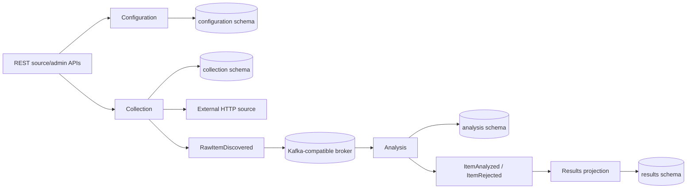

# SignalHarvester implementation guide

## Purpose and ownership

This document describes accepted **system-level current implementation**:

- what is assembled;
- how implemented modules interact;
- which infrastructure and contracts are active.

Detailed module internals belong in each module's `README.md` and `contract.md`. Test inventory and commands belong in [`TESTS.md`](TESTS.md). Planned behavior remains in active specifications.

## Build and runtime foundation

SignalHarvester is a Java 21 Gradle multi-project modular monolith with one runnable Micronaut application.

Dependency and plugin versions are centralized in `gradle/libs.versions.toml`. The Micronaut Platform version is exposed through `gradle.properties` as `micronautVersion` for the Micronaut Gradle plugins.

The current baseline pins:

- Micronaut Gradle plugin 4.6.2;
- Micronaut Framework 4.10.15;
- Protocol Buffers 4.36.1;
- JUnit 5.14.4;
- Testcontainers 2.0.5.

`app/src/main/java/io/signalharvester/Application.java` is the executable composition root.

The application uses:

- Netty runtime;
- HTTP port `SIGNALHARVESTER_HTTP_PORT`, default `8080`;
- Micronaut's Virtual-Thread-backed blocking executor on Java 21.

Synchronous REST controllers that invoke JDBC or blocking collection work use `@ExecuteOn(TaskExecutors.BLOCKING)`.

Results and Event Observation SSE controllers remain streaming `Publisher` boundaries. Their PostgreSQL polling is submitted to the blocking executor instead of running JDBC on the Netty event loop.

## Current implemented flow



`modules:results` materializes terminal Analysis events. It exposes them through:

- bounded public REST at `/api/v1/results`;
- resumable SSE at `/api/v1/results/stream`.

## Configuration module

`modules:configuration` owns persisted Source and Monitoring Profile configuration plus their REST implementations.

Its published synchronous Java surface is intentionally narrow:

- `io.signalharvester.configuration.api.SourceConfigurationProvider`;
- `io.signalharvester.configuration.api.MonitoringProfileConfigurationProvider`;
- the effective configuration types required by those providers.

Configuration administration is an internal application boundary used by module-owned HTTP adapters.

`SourceConfigurationManager` implements both the internal administration boundary and the published provider contract.

PostgreSQL schema `configuration` is created by `db/migration/configuration/V1__create_source_configuration.sql`. Application use cases own write transactions. Persistence adapters own JDBC SQL and resource handling.

See [`../modules/configuration/README.md`](../modules/configuration/README.md) and [`../modules/configuration/contract.md`](../modules/configuration/contract.md).

## Collection module

`modules:collection` owns:

- bounded external-source fetching;
- source-type extraction;
- persisted-source diagnostic testing;
- profile-driven Collection Run execution;
- interval scheduling;
- deterministic raw-item identity;
- `RawItemDiscovered` publication;
- durable completed-run history;
- `/api/v1/sources/{sourceId}/test`;
- `/api/v1/admin/collection-runs`.

Collection publishes no synchronous cross-module Java API.

`CollectionRunner`, `CollectionRunHistory`, and their run/result models are internal `collection.run` application boundaries. Collection-owned adapters, scheduling, and tests use them.

Collection resolves Monitoring Profiles and Sources only through `configuration.api`. The Gradle dependency on Configuration is therefore an `implementation` dependency.

Manual Collection Run requests provide only the persisted Monitoring Profile UUID. The profile supplies information category and ordered source membership. Disabled member sources are skipped.

External HTTP access and Kafka publication remain internal module ports.

The generic HTTP path uses Micronaut-managed low-level absolute-URI requests with explicit bounds for:

- timeouts;
- response size;
- redirects;
- connection pools;
- source concurrency.

Fetch completion is pipelined into terminal publication with backpressure. Only the bounded in-flight window may retain raw payload bodies. Final per-source results are reconstructed in configured-source order.

Source-level fetch or publication failures are best-effort terminal outcomes. They do not cancel unrelated source work.

Extraction behavior is source-type specific:

- RSS/Atom produces one semantic item per bounded feed entry;
- REST with `json.*` settings uses RFC 6901 JSON Pointer extraction;
- HTML with `html.*` settings uses jsoup CSS selectors;
- REST/HTML without those settings keeps one-response passthrough behavior.

Extracted metadata populates existing `RawItemDiscovered` fields for external ID, title, URL, content, content type, and publication time.

The Collection Run ID is reused as event correlation ID.

Raw identity is deterministic:

- passthrough identity uses source ID + URI + raw body;
- RSS/Atom and configuration-driven JSON/HTML extraction use per-item semantic identity material.

Diagnostic Source Test uses the same `ExternalSourceClient` and `SourceItemExtractor` as Collection Runs. It stops before raw-item identity/publication and run-history persistence.

The response contains bounded fetch/extraction diagnostics and preview items. Disabled Sources can therefore be tested before activation.

PostgreSQL schema `collection` evolves through:

- `V3__create_collection_run_history.sql` — durable run history;
- `V5__expand_collection_run_source_statuses.sql` — feed extraction statuses;
- `V7__create_monitoring_profile_schedule_state.sql` — collection-owned scheduler state.

Scheduling polls enabled profiles and uses short transactional PostgreSQL claims with renewable lease tokens. External fetch and Kafka work run outside the claim transaction.

A profile becomes due one configured interval after it is first observed. Completion schedules the next run from terminal completion time.

See [`../modules/collection/README.md`](../modules/collection/README.md) and [`../modules/collection/contract.md`](../modules/collection/contract.md).

## Analysis module

`modules:analysis` consumes `RawItemDiscovered` and maps transport messages into module-owned models.

The processing path performs:

1. normalization;
2. monitoring-profile-scoped durable deduplication;
3. deterministic keyword analysis;
4. terminal `ItemAnalyzed` or `ItemRejected` event creation.

The raw-item processing path remains event-driven and internal. Analysis publishes no synchronous cross-module Java API.

`AnalysisItemInspectionQuery` is an internal application boundary for `DIAGNOSTICS.ANALYSIS_INSPECTION`. The analysis-owned `/api/v1/admin/analysis/items` adapter uses it for bounded operational inspection.

PostgreSQL schema `analysis` is created by `db/migration/analysis/V2__create_normalized_item_claims.sql`. `V10__create_analysis_event_outbox.sql` adds the Analysis transactional outbox.

Logical normalized identity excludes Monitoring Profile ID. Duplicate claims are scoped by `(monitoringProfileId, normalizedItemId)`.

The Analysis listener disables automatic offset commit.

Failure behavior is explicit:

- transport, key, and mapping failures are dead-lettered immediately;
- application failures use bounded retry;
- retry exhaustion publishes the original input plus deterministic source-position dead-letter identity and failure metadata as `failure/v1/DeadLetterEvent`;
- DLQ publication failure leaves the raw source offset uncommitted.

Successful application processing means that two pieces of state commit atomically in PostgreSQL:

- deduplication state;
- exact serialized terminal Analysis event in the outbox.

`RawItemProcessingService` owns that transaction. `TransactionalAnalysisOutbox` appends final topic, key, payload, and event identity before commit.

`AnalysisOutboxDispatcher`:

- claims bounded pending batches with short PostgreSQL leases;
- publishes stored bytes to Kafka outside a database transaction;
- records success or retry state in a second short transaction.

Multiple replicas coordinate through `FOR UPDATE SKIP LOCKED` plus lease expiry.

A crash after Kafka acknowledgement but before `published_at` may republish the same stored event. Delivery therefore remains at-least-once.

Event ID, key, topic, and payload stay stable. Downstream idempotency handles the replay.

This removes the previous Kafka-ack/PostgreSQL-commit gap for Analysis authoritative state without distributed transactions.

See [`../modules/analysis/README.md`](../modules/analysis/README.md) and [`../modules/analysis/contract.md`](../modules/analysis/contract.md).

## Results module

`modules:results` consumes terminal `ItemAnalyzed` and `ItemRejected` events and materializes them into the module-owned PostgreSQL `results` schema.

Generated Protobuf messages stay inside the Kafka adapter. They are mapped to immutable Results-owned models before application or persistence logic.

`ResultProjectionService` owns the JDBC transaction.

`JdbcResultProjectionRepository` uses the transaction-aware default connection. It upserts analyzed projections by `(monitoringProfileId, normalizedItemId)`.

Tags and attributes are replaced atomically with the parent projection.

Rejections are keyed by `sourceEventId`. Retry of one raw Source event does not create another rejection row, while later rediscovery events remain separate.

The Results listener disables automatic Kafka commit:

- deterministic transport, key, and mapping failures go directly to the Results DLQ;
- projection failures retry within the configured bound;
- the consumed offset advances after the Results transaction completes or after terminal `DeadLetterEvent` acknowledgement.

This is an at-least-once/idempotent-consumer model. It does not claim distributed exactly-once processing.

`ResultQueryService` owns short read-only JDBC transactions for the public Results REST API.

The read model exposes:

- `GET /api/v1/results` — bounded recent results with profile, source, category, relevance, classification, and time filters; large normalized content is excluded from the list representation;
- `GET /api/v1/results/{normalizedItemId}?monitoringProfileId=...` — detailed content, attributes, tags, and provenance for one profile-scoped logical result.

`GET /api/v1/results/stream` exposes Results-owned SSE.

`V8` adds one durable live cursor per current logical result. The cursor advances transactionally when a new `analysisEventId` updates the projection. Redelivery of the same analysis event does not advance it.

SSE behavior is:

- fresh connections receive a `ready` cursor before later changes;
- browser reconnection resumes from `Last-Event-ID`;
- the cursor table stores current projections, not append-only update history;
- disconnected updates to one logical result may collapse to the latest projection;
- resume cursors ahead of current durable state are normalized to the current watermark.

JDBC polling runs on the blocking executor while the controller remains a streaming `Publisher` boundary.

The cursor table is shared PostgreSQL state. The Kafka consumer and SSE client can therefore be served by different backend replicas.

See [`../modules/results/README.md`](../modules/results/README.md) and [`../modules/results/contract.md`](../modules/results/contract.md).

## Event observation

`modules:event-observation` consumes published `RawItemDiscovered`, `ItemAnalyzed`, and `ItemRejected` topics through its own Kafka consumer group.

Generated Protobuf messages stay inside the Kafka adapter and are decoded into an observation-owned diagnostic model before persistence.

The listener applies the same bounded retry/dead-letter split as the other business consumers:

- deterministic decode, key, and mapping failures are terminal immediately;
- recording failures retry;
- source offsets advance only after recording or acknowledged DLQ publication.

PostgreSQL schema `event_observation` is created by `V9__create_event_observation_history.sql`.

`observed_events` stores:

- event/envelope identity;
- Kafka topic, partition, offset, and key;
- correlation and trace metadata;
- source/profile/item provenance;
- selected human-readable payload diagnostics.

Large raw and normalized content bodies are excluded.

Event identity is unique, so Kafka redelivery is idempotent. Retention is bounded by configurable maximum age and maximum row count in the same application transaction as recording.

Public diagnostic APIs are:

- `GET /api/v1/events` — bounded technical history filters;
- `GET /api/v1/events/stream` — durable `ready`, `event`, and `keepalive` SSE cursors with `Last-Event-ID` resume;
- `GET /api/v1/flows/collection-runs/{collectionRunId}` — run-level Processing Flow;
- the run-scoped item variant — item Processing Flow.

Processing Flow is reconstructed on read from retained observation rows.

Flow nodes state whether evidence is:

- directly observed;
- derived from current event semantics;
- not observed.

Raw-to-terminal branches use published terminal `sourceEventId`. Repeated logical content therefore remains separated by discovery event.

Results persistence is currently an expected `NOT_OBSERVED` stage. The graph does not claim it completed without observation evidence.

Observation state and Processing Flow are diagnostic materializations. They are not authoritative business state.

See [`../modules/event-observation/README.md`](../modules/event-observation/README.md) and [`../modules/event-observation/contract.md`](../modules/event-observation/contract.md).

## Authentication and authorization

`modules/security` implements the accepted backend security slice.

It owns:

- identities and explicit roles in the `security` PostgreSQL schema;
- salted PBKDF2-HMAC-SHA256 local password hashes;
- a blocking Micronaut Security authentication provider;
- current-principal HTTP API;
- ADMIN-only user-management HTTP APIs.

Role invariants are explicit:

- `HUMAN` accounts always include `USER`;
- `BOT` accounts always include `BOT`;
- `VIEWER` and `ADMIN` are independent additive roles.

The default trusted-local environment keeps security disabled for compatibility.

Activating the `security` Micronaut environment enables:

- short-lived signed JWT authentication;
- HttpOnly browser JWT cookies;
- bearer-token validation;
- signed double-submit CSRF;
- explicit credentialed CORS configuration;
- the cross-module endpoint/role matrix.

Results REST/SSE require `VIEWER`. Existing configuration, operations, and diagnostics require `ADMIN`. Health and Prometheus remain anonymously reachable in the accepted local deployment slice.

Authentication outcomes, administrative identity changes, and 401/403 API rejections are logged without credential or token contents.

No login/session table exists.

Disabling an account blocks future credential authentication. Already-issued JWTs remain valid until their short expiry.

Administrative updates cannot disable or demote the last enabled `ADMIN`. The persistence boundary serializes these updates before evaluating that invariant.

The first administrator can be created from deployment-provided bootstrap credentials only when no enabled ADMIN exists. The repository contains no default administrator credential.

## External-source access security

`SECURITY.EXTERNAL_SOURCE_ACCESS` is accepted.

Collection owns runtime destination authorization through the named `signalharvester-external-source-access` Netty `AddressResolverGroup` used by the managed HTTP client.

The resolver:

- resolves hostnames off the Netty event loop on Java 21 Virtual Threads;
- authorizes the complete DNS answer set used by the connection path;
- rejects mixed safe/unsafe answers in `SECURE` mode;
- revalidates cross-host redirects before connection;
- forces literal IP destinations through the same policy path.

Configuration validates URI syntax only. Live network authorization remains Collection-owned.

The default `TRUSTED_LOCAL` mode permits loopback/private destinations for deterministic development fixtures while still rejecting unspecified and multicast destinations.

The `security` environment selects `SECURE` mode.

It blocks loopback, link-local, IPv4 private/site-local, carrier-grade/shared, and IPv6 unique-local destinations unless an operator explicitly authorizes the required network with `SIGNALHARVESTER_COLLECTION_OUTBOUND_ALLOWED_CIDRS`.

Policy rejection maps to the existing source-fetch failure boundary:

- Source Test reports `FETCH_FAILED`;
- Collection Runs isolate the failed Source;
- no Kafka event is published for that failed fetch;
- unrelated Sources are not cancelled.

## External contracts

The authoritative REST contract is [`../contracts/api-contracts/src/main/resources/openapi/signalharvester-v1.yaml`](../contracts/api-contracts/src/main/resources/openapi/signalharvester-v1.yaml).

It currently covers:

- Source and Monitoring Profile CRUD;
- persisted-source diagnostic testing;
- profile-driven manual Collection Run/history operations;
- Analysis inspection;
- public Results browsing/detail;
- resumable Results SSE;
- bounded Event Explorer REST history;
- live technical-event SSE;
- reconstructed Processing Flow graphs;
- accepted authentication/current-principal/user-administration APIs.

The authoritative Kafka schemas are versioned `.proto` files under `contracts/event-contracts/src/main/proto/`:

```text
common/v1/event-envelope.proto
collection/v1/raw-item-discovered.proto
analysis/v1/item-analyzed.proto
analysis/v1/item-rejected.proto
failure/v1/dead-letter-event.proto
```

Generated Protobuf Java classes are build output. They remain transport types at Kafka adapter boundaries.

## Persistence and Flyway

Configuration, Analysis, Collection, Results, Event Observation, and Security share one physical datasource and one Flyway schema history. Each module still owns its PostgreSQL schema and tables.

Migration locations are configured in `app/src/main/resources/application.properties`.

Because Flyway history is shared, versions are globally coordinated across module locations:

- `V1` — Configuration Sources;
- `V2` — Analysis deduplication state;
- `V3` — Collection Run history;
- `V4` — Results;
- `V5` — Collection extraction status expansion;
- `V6` — Configuration Monitoring Profiles;
- `V7` — Collection scheduling;
- `V8` — Results live cursors;
- `V9` — Event Observation history;
- `V10` — Analysis event outbox;
- `V11` — Analysis outbox trace context;
- `V12` — Security identities and roles.

Direct cross-module table access remains forbidden.

## Application observability

The composition root includes Micronaut management, Micrometer Prometheus, and OpenTelemetry instrumentation.

It exposes:

- `/health`;
- `/health/liveness`;
- `/health/readiness`;
- `/prometheus`.

Trace export defaults to `none`. Configuring the OTLP exporter enables external trace collection without changing module behavior.

Collection records low-cardinality Collection Run/source-fetch metrics and creates one application span per manual or scheduled run.

Its Virtual-Thread fetch fan-out wraps submitted work with Micronaut `PropagatedContext`, so HTTP client spans remain attached to the Collection trace.

Analysis records processing and outbox metrics.

`V11__add_analysis_outbox_trace_context.sql` persists active W3C `traceparent` with staged terminal-event bytes. The dispatcher restores it around Kafka send.

Logback keeps console output as the deployment logging boundary. OpenTelemetry MDC integration adds `trace_id` and `span_id` when a valid span is current.

Event Explorer and Processing Flow remain separate retained application diagnostics. They are not reconstructed from trace storage.

## Kubernetes and infrastructure observability

The backend-owned production-style local Kubernetes slice is accepted after live developer verification.

Repository assets include:

- `app/Dockerfile` for a non-root Java 21 backend image built from the Gradle application distribution;
- `infra/kubernetes/` Kustomize assets;
- PostgreSQL;
- single-node Redpanda;
- two backend replicas in the default local target;
- explicit current application/DLQ topic provisioning;
- deployment-owned runtime secrets;
- health/readiness probes.

The same target deploys:

- Prometheus;
- Loki;
- Tempo;
- Grafana Alloy;
- kube-state-metrics;
- Grafana.

Prometheus scrapes backend, Redpanda, and Kubernetes workload-state metrics.

The backend exports OTLP traces to Tempo. Tempo generates span metrics and remote-writes them to Prometheus. Alloy sends namespace pod logs to Loki.

Grafana starts with Prometheus, Loki, and Tempo data sources plus a repository-owned operational dashboard.

The separate frontend repository still owns the real frontend image. `infra/kubernetes/frontend/` defines only the expected runtime workload boundary. Full umbrella R24 therefore remains incomplete.

`infra/kubernetes/resilience/` provides the accepted live resilience acceptance layer.

Its deterministic harness covers:

- backend container restart with an existing JWT;
- slow-source availability;
- PostgreSQL outage with bounded retry exhaustion and Analysis DLQ publication;
- observable Analysis consumer lag and recovery;
- Analysis outbox recovery across rollout;
- one scheduled run under two replicas;
- Redpanda restart recovery;
- authorization boundaries;
- Loki, Tempo, and Prometheus evidence.

The harness temporarily allows only its deterministic RSS fixture Service through the accepted outbound-source CIDR override. It does not add production Java endpoints or wire contracts.

## Kafka consumer horizontal scaling

`SCALABILITY.KAFKA_CONSUMERS` uses the existing single backend Deployment. It does not split Java modules into separate deployments.

Analysis, Results, and Event Observation keep stable shared Kafka consumer groups. Local application topics have three partitions.

The opt-in `infra/kubernetes/scaling/run_acceptance.py` workflow:

1. creates a bounded unique-item backlog;
2. establishes one Analysis worker with positive lag;
3. scales the backend to three replicas;
4. verifies active consumer membership and raw partition assignment;
5. waits for lag to drain without manual offset changes;
6. checks durable Analysis/Results completeness;
7. checks outbox completion and DLQ stability;
8. checks authenticated HTTP availability;
9. restores temporary deployment state.

Implementation is complete. Developer live-cluster acceptance remains pending.

## Testing implementation

The root Gradle build separates fast/default tests from integration tests through distinct source sets:

- `./gradlew test` runs regular `src/test` unit, behavior, and contract tests;
- `./gradlew integrationTest` runs `src/integrationTest` scenarios, including Testcontainers and cross-module flows.

The separation is structural rather than tag-based. A correctly placed integration test cannot accidentally execute as part of the default `test` lifecycle.

`ModuleBoundaryArchitectureTest` rejects production dependencies from one functional module to another module outside the providing module's `api..` package.

See [`TESTS.md`](TESTS.md) for the authoritative test inventory, infrastructure requirements, and focused commands.

## Local infrastructure

`infra/docker-compose/compose.yaml` remains the lightweight host-run development path for PostgreSQL and Redpanda.

The accepted backend-owned production-style local Kubernetes stack is under `infra/kubernetes/`.

See:

- [`../infra/docker-compose/README.md`](../infra/docker-compose/README.md) for host-run development;
- [`../infra/kubernetes/README.md`](../infra/kubernetes/README.md) for the local cluster workflow.

## Known limitations

- Interval scheduling is implemented. Cron/calendar scheduling and missed-interval catch-up are not.
- Results provide bounded REST filters. Cursor pagination and full-text search are not implemented.
- Processing Flow cannot prove Results persistence until an observation signal exists for that stage.
- Backend-owned Kubernetes/infrastructure deployment and resilience acceptance are verified. Full platform R24 still requires a real frontend image from `signalharvester-web`.
- Kafka consumer horizontal scaling is implemented but remains verification-pending until live developer execution.
- There is no cross-resource exactly-once guarantee between PostgreSQL and Kafka.
- Controlled DLQ replay tooling/UI is not implemented. Failed records remain operator-managed in versioned dead-letter topics.
