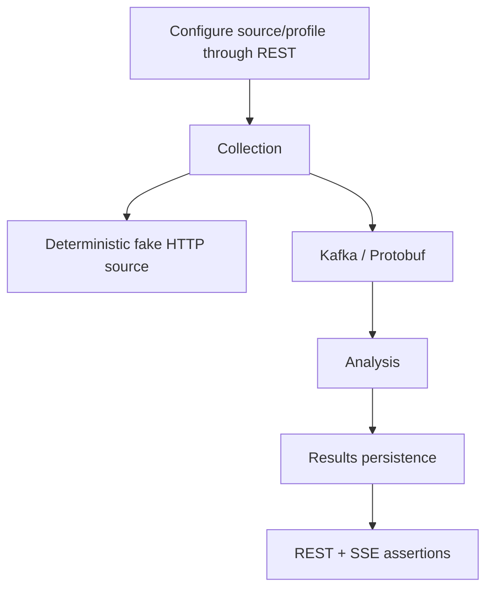

# Tests and validation

## Testing principles

Tests verify behavior and contracts, not implementation trivia.

Default automated tests must not require public network access, live external websites, SaaS accounts, or production credentials.

## Test layers

- module unit/behavior tests live with the owning module;
- contract tests live with API/event contract ownership;
- reusable deterministic fixtures belong in `testing/test-support` only when genuinely shared;
- cross-module/backend integration tests belong in `testing/integration-tests`;
- architectural dependency checks may use ArchUnit when meaningful package boundaries exist.

## Current validation commands

Use the repository Gradle Wrapper.

```bash
./gradlew :modules:configuration:test
./gradlew :modules:collection:test
./gradlew :contracts:event-contracts:test
./gradlew :app:test
./gradlew test
```

On systems where executable permission is not preserved after extracting an archive, use `bash ./gradlew ...` or restore the executable bit.

## Integration infrastructure

`testing:integration-tests` already declares Testcontainers support for PostgreSQL and Kafka. Add container-backed tests only when the scenario exercises real persistence or Kafka behavior.

External HTTP sources must be deterministic local/fake servers controlled by tests.

The target end-to-end scenario remains:



## Current tests

The first implementation foundation contains:

- `ApplicationContextTest` for Micronaut context bootstrap;
- `ConfiguredSourceTest` for configuration-boundary invariants;
- `RawItemDiscoveredSerializationTest` for Protobuf round-trip and unknown additive fields;
- `JdkHttpExternalSourceClientTest` for successful, non-successful, and oversized deterministic HTTP responses;
- `VirtualThreadSourceFetchCoordinatorTest` for Virtual Thread execution and deterministic result ordering.

No Docker/Testcontainers test is implemented yet because persistence and Kafka adapters do not exist.

## Python

Python may be used later for independent black-box/load/data tooling. It is not the primary backend integration-test framework.
