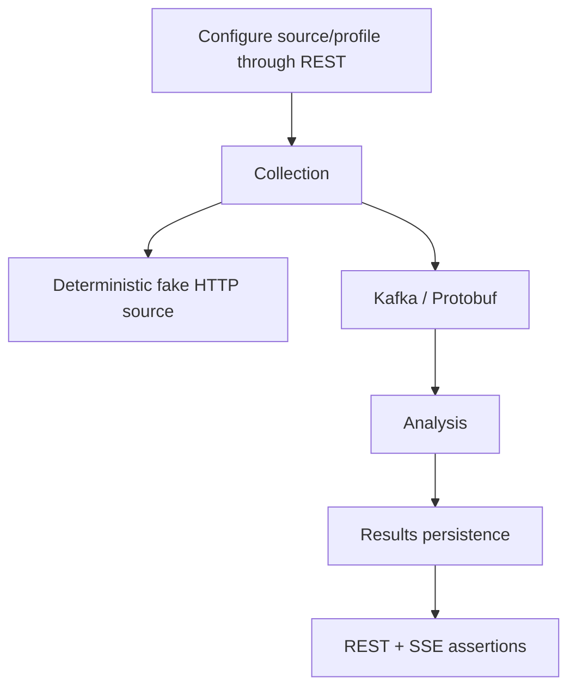

# Tests and validation

## Testing principles

Tests verify behavior and contracts, not implementation trivia.

Default automated tests must not require public network access, live external websites, SaaS accounts, or production credentials.

## Test layers

- module unit/behavior tests live with the owning module;
- contract tests live with API/event contract ownership;
- reusable deterministic fixtures belong in `testing/test-support` only when genuinely shared;
- cross-module/backend integration tests belong in `testing/integration-tests`;
- architectural dependency checks use ArchUnit for the established functional-module package boundaries.

## Current validation commands

Use the repository Gradle Wrapper. The canonical full repository gate is:

```bash
./run_checks.sh
```

`run_checks.sh` performs, in order:

1. `docker info` preflight for container-backed verification;
2. optional `git diff --check` when running inside a Git worktree;
3. `./tools/source-import/run_tests.sh` for deterministic source-import tooling regression coverage;
4. `./gradlew clean check --no-watch-fs`;
5. `./gradlew integrationTest --no-watch-fs`;
6. generation of a temporary FULL archive and validation that it contains `gradle-wrapper.jar` while excluding local/generated artifacts and unrelated JARs.

The script prints a final PASS/FAIL summary of every routine verification step that actually ran and lists the relevant test/problems report locations. Use focused Gradle commands during development, but run `./run_checks.sh` before treating a substantial PATCH or branch as functionally verified. Slower coverage/static/dependency analysis and repository-size metrics run through `./run_rare_checks.sh`; quality-tool policy and report ownership are documented in [`QUALITY.md`](QUALITY.md).

Fast/default verification compiles and runs only the regular `src/test` source sets:

```bash
./gradlew test
```

Container-backed integration tests live in dedicated `src/integrationTest` source sets and are therefore structurally absent from the default `test` lifecycle. A module may have no regular tests even when it owns integration coverage.

Run all container-backed and cross-module integration tests explicitly:

```bash
./gradlew integrationTest
```

Focused commands follow the same source-set split:

```bash
./gradlew :modules:configuration:test
./gradlew :modules:configuration:integrationTest
./gradlew :modules:collection:test
./gradlew :modules:collection:integrationTest
./gradlew :modules:analysis:test
./gradlew :modules:analysis:integrationTest
./gradlew :modules:results:test
./gradlew :modules:results:integrationTest
./gradlew :contracts:event-contracts:test
./gradlew :app:test
./gradlew :testing:integration-tests:integrationTest
```

On systems where executable permission is not preserved after extracting an archive, use `bash ./gradlew ...` or restore the executable bit.

When adding integration coverage, place it under `src/integrationTest/java` (and `src/integrationTest/resources` when needed). Do not put Testcontainers or cross-module integration scenarios under `src/test` and rely on tags to keep them out of the fast lifecycle.

## Integration infrastructure

`modules:configuration` uses PostgreSQL Testcontainers for its persistence/server boundary. `modules:collection` uses Kafka Testcontainers for its producer/consumer transport boundary. `modules:analysis` uses PostgreSQL Testcontainers for durable deduplication. `modules:results` uses PostgreSQL + Kafka Testcontainers for real terminal-event consumption and idempotent projection persistence. `testing:integration-tests` uses PostgreSQL + Kafka Testcontainers together for collection-run and collection-to-analysis flows. Container-backed tests require a supported Docker-compatible runtime.

External HTTP sources must be deterministic local/fake servers controlled by tests. Blocking HTTP/controller tests must also verify that work is offloaded from Netty event-loop threads when that execution boundary is implemented.

The target end-to-end scenario remains:



## Current tests

The first implementation foundation contains:

- `ApplicationContextTest` for Micronaut context bootstrap;
- `ModuleBoundaryArchitectureTest` for enforcing published-API-only cross-module dependencies, an acyclic functional-module graph, framework-free published API packages, no direct HTTP-adapter-to-persistence coupling, and no dependency from functional modules back to the application composition root;
- `ConfiguredSourceTest` for configuration-boundary invariants;
- `RawItemDiscoveredSerializationTest` and `AnalysisEventSerializationTest` for Protobuf round trips and unknown additive fields on raw, analyzed, and rejected event families;
- `ExternalSourceHttpClientTest` for Micronaut-managed synchronous absolute-URL calls across different hosts, scoped filter headers, HTTP response-exception handling, query preservation, configured read timeouts, redirect-limit enforcement, and response-size enforcement against deterministic loopback servers;
- `MicronautExternalSourceClientTest` for successful/empty responses, transport failure normalization, status mapping, and `Retry-After` preservation with a deterministic clock;
- `SourceFetchCoordinatorTest` for bounded Virtual Thread concurrency, backpressure before replacement fetch submission, deterministic source-index reconstruction, empty batches, and best-effort continuation of queued/in-flight work after a source-level failure;
- `CollectionRunServiceTest` for explicit run identity/correlation, success/partial/failed/empty outcomes, and continued Kafka publication after one publication failure;
- `RawItemIdentityFactoryTest` for stable raw-item identity across fetch timestamps and changed payload identity;
- `MicronautBlockingExecutorTest` for verification that Micronaut's blocking executor is Virtual-Thread backed on the Java 21 baseline and that the collection bean graph resolves with its qualified UTC clock;
- `CollectionConfigurationTest` for Jakarta Validation of invalid concurrency configuration;
- `RawItemDiscoveredMapperTest` for event identity/correlation/provenance mapping and response charset handling;
- `KafkaRawItemEventPublisherTest` for explicit Protobuf byte serialization, topic/key behavior, and failure normalization;
- `KafkaRawItemEventPublisherIntegrationTest` for a real Micronaut producer -> Kafka Testcontainers -> byte-array consumer -> `RawItemDiscovered` round trip;
- `CollectionRunHistoryPostgresTest` for collection-owned Flyway bootstrap, atomic run/source-outcome persistence, enforced application-owned transaction boundaries, restart-safe durable reads, bounded recent-history validation, deterministic ordering, and source-outcome association across multi-run reads;
- `CollectionRunControllerTest` for server-level manual-run/history status mapping, validation/default limits, required JSON response shape, and blocking Virtual Thread execution without external infrastructure;
- `ConfigurationPostgresIntegrationTest` for Flyway bootstrap, persisted CRUD/provider behavior, restart-safe provider reads, duplicate-name semantics, and transactional rollback for both create and update settings failures;
- `SourceControllerPostgresTest` for real HTTP CRUD/status validation against PostgreSQL and blocking Virtual Thread execution;
- `SourceLocationValidatorTest` for REST URI validation parity with `ConfiguredSource`;
- `DefaultContentNormalizerTest` for deterministic whitespace/URL normalization and stable normalized identity;
- `KeywordContentAnalyzerTest` for deterministic relevance/classification/scoring rules and invalid rule configuration;
- `DeduplicationPostgresIntegrationTest` for durable profile-scoped duplicate claims, discovery counters, real SQL inspection filtering/ordering/limits, and enforcement of the application-owned JDBC transaction boundary;
- `RawItemProcessingPostgresIntegrationTest` for focused new/irrelevant/duplicate processing, independent cross-profile acceptance, claim/counter rollback, and input-offset retention when terminal publication fails;
- `AnalysisItemInspectionControllerTest` for server-level inspection filters, validation/not-found semantics, required nullable JSON fields, and blocking Virtual Thread execution without external infrastructure;
- `RawItemKafkaListenerTest` for explicit offset commit after success plus no-commit behavior for processing failure, malformed Protobuf, Kafka key mismatch, and invalid mapped domain data;
- `KafkaAnalysisEventPublisherTest` for analyzed/rejected topic-key mapping, full provenance serialization, and publication-failure normalization;
- `AnalysisOutcomeKafkaListenerTest` for Results terminal-event mapping, Kafka key validation, poison-input handling, persistence-failure no-commit behavior, and manual offset commit after successful projection;
- `ResultsKafkaPostgresIntegrationTest` for real Kafka -> Results listener -> PostgreSQL materialization of analyzed/rejected events, including idempotent retry/upsert behavior and transactional replacement of result tags/attributes;
- `CollectionRunIntegrationTest` for persisted enabled-source selection, deterministic local HTTP fetch, source-level partial failure, run correlation, disabled-source exclusion, and successful Kafka publication;
- `CollectionAnalysisIntegrationTest` for persisted source -> deterministic HTTP -> raw Kafka -> analysis -> analyzed/rejected Kafka, including equivalent normalized rediscovery with different raw ids.
- `HttpPipelineSmokeIntegrationTest` for black-box REST source configuration -> manual collection -> deterministic HTTP source -> Kafka -> Analysis -> durable collection history and analysis inspection, including equivalent rediscovery observed through public HTTP APIs only.

PostgreSQL Testcontainers tests are implemented in `modules:configuration`, `modules:collection`, and `modules:analysis`; Kafka producer round-trip coverage is also implemented in `modules:collection`. Cross-module scenarios under `testing:integration-tests` verify both collection-run assembly and the first real consumer chain through normalized deduplication and terminal analysis events.

## Trial-readiness regression gate

Before using real sources for a controlled trial, the backend should keep the following high-risk flow protected:

```text
raw Kafka input
    -> analysis claim/update
    -> terminal publication
    -> transaction completion
    -> input offset commit
```

The analysis module verifies rollback/no-commit behavior for terminal publication failure and poison-input no-commit behavior. `HttpPipelineSmokeIntegrationTest` now starts from source configuration/manual collection REST endpoints and observes durable collection history plus analysis inspection through public HTTP APIs while PostgreSQL, Kafka, and the deterministic external source stay behind the backend boundary. Results persistence now retains terminal analyzed/rejected outcomes. A Results read REST API is still required before the broader product trial can inspect that user-facing state without direct database access.

## Python tooling tests

Python is used for independent black-box/data tooling, not as the primary backend test framework. The source-manifest importer owns fast standard-library regression tests under `tools/source-import/tests` and they are part of the canonical `run_checks.sh` gate.

Run them directly with:

```bash
./tools/source-import/run_tests.sh
```

The importer tests use deterministic fakes and a loopback HTTP server only. They do not require Docker, a running backend, or public network access.


## Operational admin API

Focused validation for the manual-run/history and analysis-inspection slice:

```bash
./gradlew :modules:collection:test :modules:analysis:test :app:test --no-watch-fs
./gradlew :modules:collection:integrationTest :modules:analysis:integrationTest :testing:integration-tests:integrationTest --no-watch-fs
```

Collection tests cover durable PostgreSQL run/source history; analysis PostgreSQL tests cover bounded inspection of durable normalized-item claims. Server-level HTTP coverage now verifies source CRUD plus the collection-admin and analysis-inspection endpoints, including validation/status mapping and blocking Virtual Thread execution. The operational-admin slice has completed its focused Gradle and container-backed verification and its spec is archived; these commands remain useful targeted regressions.
