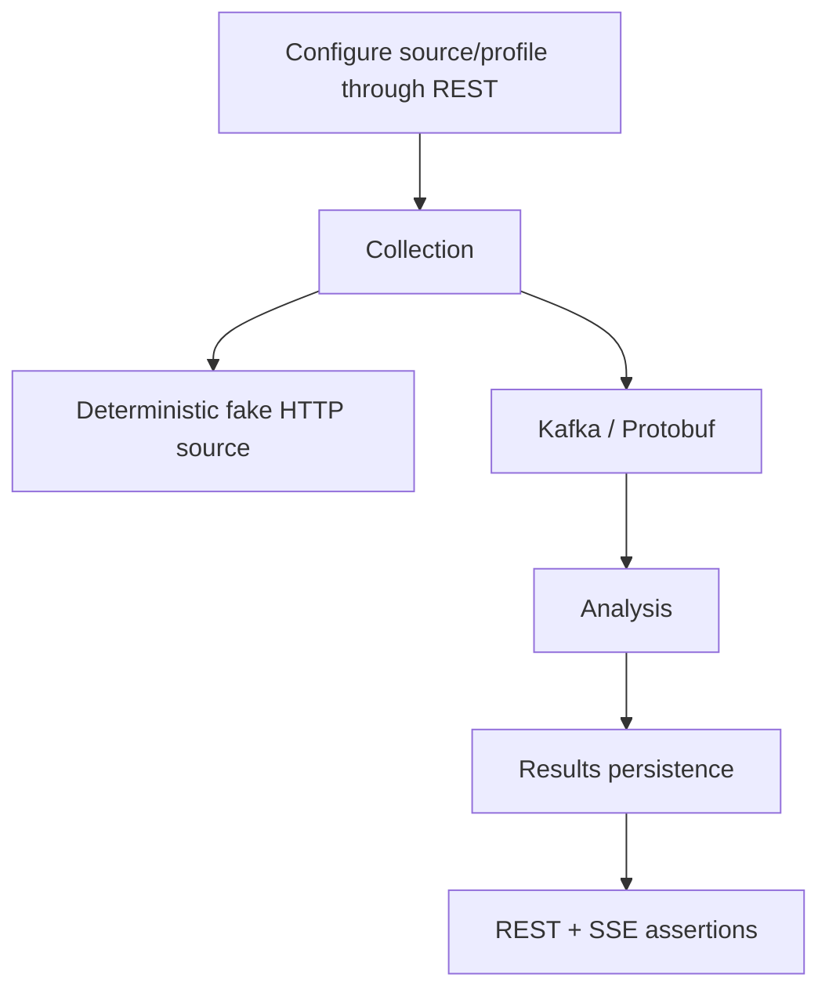

# Tests and validation

## Testing principles

Tests verify behavior and contracts, not implementation trivia.

Default automated tests must not require public network access, live external websites, SaaS accounts, or production credentials.

## Test layers

- module unit/behavior tests live with the owning module;
- contract tests live with API/event contract ownership;
- reusable deterministic fixtures belong in `testing/test-support` only when genuinely shared;
- cross-module/backend integration tests belong in `testing/integration-tests`;
- architectural dependency checks use ArchUnit for the established functional-module package boundaries.

## Current validation commands

Use the repository Gradle Wrapper. The canonical full repository gate is:

```bash
./run_checks.sh
```

`run_checks.sh` performs, in order:

1. `docker info` preflight for container-backed verification;
2. optional `git diff --check` when running inside a Git worktree;
3. `./tools/source-import/run_tests.sh` and `./tools/live-backend/run_tests.sh` for deterministic Python tooling regression coverage;
4. `./gradlew clean check --no-watch-fs`;
5. `./gradlew integrationTest --no-watch-fs --no-parallel`;
6. generation of a temporary FULL archive and validation that it contains `gradle-wrapper.jar` while excluding local/generated artifacts and unrelated JARs.

The script prints a final PASS/FAIL summary of every routine verification step that actually ran and lists the relevant test/problems report locations. Use focused Gradle commands during development, but run `./run_checks.sh` before treating a substantial PATCH or branch as functionally verified. Slower coverage/static/dependency analysis and repository-size metrics run through `./run_rare_checks.sh`; quality-tool policy and report ownership are documented in [`QUALITY.md`](QUALITY.md).

Fast/default verification compiles and runs only the regular `src/test` source sets:

```bash
./gradlew test
```

Container-backed integration tests live in dedicated `src/integrationTest` source sets and are therefore structurally absent from the default `test` lifecycle. A module may have no regular tests even when it owns integration coverage.

Run all container-backed and cross-module integration tests explicitly:

```bash
./gradlew integrationTest --no-watch-fs --no-parallel
```

Focused commands follow the same source-set split:

```bash
./gradlew :modules:configuration:test
./gradlew :modules:configuration:integrationTest
./gradlew :modules:collection:test
./gradlew :modules:collection:integrationTest
./gradlew :modules:analysis:test
./gradlew :modules:analysis:integrationTest
./gradlew :modules:results:test
./gradlew :modules:results:integrationTest
./gradlew :contracts:event-contracts:test
./gradlew :app:test
./gradlew :testing:integration-tests:integrationTest
```

On systems where executable permission is not preserved after extracting an archive, use `bash ./gradlew ...` or restore the executable bit.

When adding integration coverage, place it under `src/integrationTest/java` (and `src/integrationTest/resources` when needed). Do not put Testcontainers or cross-module integration scenarios under `src/test` and rely on tags to keep them out of the fast lifecycle.

## Integration infrastructure

`modules:configuration` uses PostgreSQL Testcontainers for its persistence/server boundary. `modules:collection` uses Kafka Testcontainers for its producer/consumer transport boundary. `modules:analysis` uses PostgreSQL Testcontainers for durable deduplication. `modules:results` uses PostgreSQL + Kafka Testcontainers for real terminal-event consumption and idempotent projection persistence. `testing:integration-tests` uses PostgreSQL + Kafka Testcontainers together for collection-run and collection-to-analysis flows. Container-backed tests require a supported Docker-compatible runtime.

The repository intentionally disables Gradle project parallelism for the full `integrationTest` suite. Several modules start PostgreSQL and Kafka Testcontainers, and launching those project tasks concurrently can overload developer Docker runtimes and cause container readiness timeouts. This does not disable parallelism for the normal `clean check` phase.

External HTTP sources must be deterministic local/fake servers controlled by tests. Blocking HTTP/controller tests must also verify that work is offloaded from Netty event-loop threads when that execution boundary is implemented.

The target end-to-end scenario remains:



## Current tests

The first implementation foundation contains:

- `ApplicationContextTest` for Micronaut context bootstrap;
- `ModuleBoundaryArchitectureTest` for enforcing published-API-only cross-module dependencies, an acyclic functional-module graph, framework-free published API packages, no direct HTTP-adapter-to-persistence coupling, and no dependency from functional modules back to the application composition root;
- `ConfiguredSourceTest` for configuration-boundary invariants;
- `RawItemDiscoveredSerializationTest` and `AnalysisEventSerializationTest` for Protobuf round trips and unknown additive fields on raw, analyzed, and rejected event families;
- `DeadLetterEventSerializationTest` for round-trip preservation of deterministic dead-letter identity, source Kafka position/payload, failure diagnostics, attempts, and retryability metadata;
- `ExternalSourceHttpClientTest` for Micronaut-managed synchronous absolute-URL calls across different hosts, scoped filter headers, HTTP response-exception handling, query preservation, configured read timeouts, redirect-limit enforcement, and response-size enforcement against deterministic loopback servers;
- `MicronautExternalSourceClientTest` for successful/empty responses, transport failure normalization, status mapping, and `Retry-After` preservation with a deterministic clock;
- `SourceFetchCoordinatorTest` for bounded Virtual Thread concurrency, backpressure before replacement fetch submission, deterministic source-index reconstruction, empty batches, and best-effort continuation of queued/in-flight work after a source-level failure;
- `CollectionRunServiceTest` for explicit run identity/correlation, success/partial/failed/empty outcomes, multiple RSS item publications, no-items/extraction-failure semantics, and continued Kafka publication after one publication failure;
- `RawItemIdentityFactoryTest` for stable raw-item identity across fetch timestamps and changed payload identity;
- `MicronautBlockingExecutorTest` for verification that Micronaut's blocking executor is Virtual-Thread backed on the Java 21 baseline and that the collection bean graph resolves with its qualified UTC clock;
- `CollectionConfigurationTest` for Jakarta Validation of invalid concurrency configuration;
- `RssAtomItemExtractorTest` and `DefaultSourceItemExtractorTest` for secure bounded RSS/Atom parsing, metadata extraction, malformed/DTD rejection, feed-item limits, empty feeds, and non-feed passthrough identity compatibility;
- `JsonSourceItemExtractorTest` and `HtmlSourceItemExtractorTest` for configuration-driven JSON Pointer/CSS-selector extraction, semantic metadata, relative URLs, malformed configuration, and generic candidate-item bounds;
- `GenericExtractionConfigurationTest`, `SourceTestConfigurationTest`, and `SourceTestServiceTest` for fail-fast extraction/preview limits plus disabled-source diagnostics, fetch/extraction failures, missing sources, and bounded previews;
- `SourceTestControllerTest` for server-level source-test response mapping, missing/invalid identity handling, and blocking Virtual Thread execution;
- `RawItemDiscoveredMapperTest` for event identity/correlation/provenance mapping including extracted external id, title, and publication time;
- `KafkaRawItemEventPublisherTest` for explicit Protobuf byte serialization, topic/key behavior, and failure normalization;
- `KafkaRawItemEventPublisherIntegrationTest` for a real Micronaut producer -> Kafka Testcontainers -> byte-array consumer -> `RawItemDiscovered` round trip;
- `CollectionRunHistoryPostgresTest` for collection-owned Flyway bootstrap, atomic run/source/item-outcome persistence, extraction-status migration/round-trip, enforced application-owned transaction boundaries, restart-safe durable reads, bounded recent-history validation, deterministic ordering, and outcome association across multi-run reads;
- `ProfileSchedulePostgresTest` for persisted interval state, interval-change rescheduling, and exclusive due-work lease claims across two application contexts sharing PostgreSQL;
- `CollectionRunControllerTest` for server-level manual-run/history status mapping, validation/default limits, required JSON response shape, and blocking Virtual Thread execution without external infrastructure;
- `ConfigurationPostgresIntegrationTest` for Flyway bootstrap, persisted CRUD/provider behavior, restart-safe provider reads, duplicate-name semantics, and transactional rollback for both create and update settings failures;
- `SourceControllerPostgresTest` for real HTTP CRUD/status validation against PostgreSQL and blocking Virtual Thread execution;
- `SourceLocationValidatorTest` for REST URI validation parity with `ConfiguredSource`;
- `DefaultContentNormalizerTest` for deterministic whitespace/URL normalization and stable normalized identity;
- `KeywordContentAnalyzerTest` for deterministic relevance/classification/scoring rules and invalid rule configuration;
- `DeduplicationPostgresIntegrationTest` for durable profile-scoped duplicate claims, discovery counters, real SQL inspection filtering/ordering/limits, and enforcement of the application-owned JDBC transaction boundary;
- `RawItemProcessingPostgresIntegrationTest` for focused new/irrelevant/duplicate processing, independent cross-profile acceptance, atomic deduplication/outbox commit, persisted outbox trace context, outbox retry metadata, and claim/counter rollback when outbox staging fails;
- `CollectionObservabilityTest` and `AnalysisObservabilityTest` for low-cardinality application metric emission with telemetry disabled safely through no-op boundaries;
- `ApplicationObservabilityTest` for `/health`, liveness/readiness, and deterministic `/prometheus` exposure without PostgreSQL or Kafka;
- `AnalysisItemInspectionControllerTest` for server-level inspection filters, validation/not-found semantics, required nullable JSON fields, and blocking Virtual Thread execution without external infrastructure;
- `RawItemKafkaListenerTest` for Analysis bounded retry recovery, immediate poison/key failure dead-letter handling, retry exhaustion, and no source-offset commit when DLQ publication fails;
- `TransactionalAnalysisOutboxTest` for analyzed/rejected final topic-key mapping, stable terminal-event serialization, provenance, and outbox staging metadata;
- `AnalysisOutcomeKafkaListenerTest` for Results terminal-event mapping, bounded projection retry, poison-input dead-letter handling, retry exhaustion, and no source-offset commit when DLQ publication fails;
- `ResultsKafkaPostgresIntegrationTest` for real Kafka -> Results listener -> PostgreSQL materialization, including idempotent retry/upsert behavior, transactional replacement of result tags/attributes, live-cursor advancement only for a new analysis-event identity, and poison-record DLQ handling followed by same-partition progress;
- `ResultControllerTest` for public Results list/detail HTTP defaults, filters, validation/not-found mapping, stable nullable JSON fields, and blocking Virtual Thread execution;
- `ResultLiveControllerTest` for SSE ready/result framing, `Last-Event-ID` resume behavior, live filters, cursor validation, and JDBC polling on the blocking Virtual Thread executor;
- `ResultQueryPostgresIntegrationTest` for real Results SQL filtering, newest-first ordering, bounded limits, ordered tags, attributes, profile-scoped detail reads, durable live polling, and duplicate-analysis-event cursor idempotency;
- `EventObservationMapperTest` for decoded human-readable metadata across the current raw/analyzed/rejected Protobuf event families without copying large content bodies;
- `EventObservationKafkaListenerTest` for bounded recording retry, immediate poison dead-letter handling, and no source-offset commit when Event Observation DLQ publication fails;
- `EventObservationControllerTest` for bounded Event Explorer REST filters, decoded JSON shape, validation, and blocking Virtual Thread execution;
- `EventObservationLiveControllerTest` for `ready`/`event` SSE framing, `Last-Event-ID` resume, technical filters, cursor validation, and blocking-query offload;
- `ProcessingFlowServiceTest` for analyzed, duplicate, in-progress, partial-history, and run-scoped item graph reconstruction with explicit evidence levels;
- `ProcessingFlowControllerTest` for collection-run/item graph routes, stable JSON shape, 404 mapping, and blocking Virtual Thread execution;
- `EventObservationKafkaPostgresIntegrationTest` for real Kafka -> Event Observation -> PostgreSQL decoding, event-id idempotency, selected diagnostics, and count-bounded retention;
- `CollectionRunIntegrationTest` for persisted enabled-source selection, deterministic local HTTP fetch, source-level partial failure, run correlation, disabled-source exclusion, and successful Kafka publication;
- `CollectionAnalysisIntegrationTest` for persisted source -> deterministic HTTP -> raw Kafka -> analysis -> analyzed/rejected Kafka, including equivalent normalized rediscovery with different raw ids.
- `HttpPipelineSmokeIntegrationTest` for black-box REST source configuration -> source-test/generic JSON extraction and manual collection -> deterministic HTTP source -> Kafka -> Analysis -> Results -> REST/SSE plus decoded Event Observation history and run-scoped processing-flow reconstruction. The source-test branch verifies a disabled persisted JSON source through public HTTP and confirms that diagnostics do not create collection-run history.

PostgreSQL Testcontainers tests are implemented in `modules:configuration`, `modules:collection`, `modules:analysis`, `modules:results`, and `modules:event-observation`; Kafka producer round-trip coverage is also implemented in `modules:collection`. Cross-module scenarios under `testing:integration-tests` verify both collection-run assembly and the first real consumer chain through normalized deduplication and terminal analysis events.

## Trial-readiness regression gate

Before using real sources for a controlled trial, the backend should keep the following high-risk flow protected:

```text
raw Kafka input
    -> analysis claim/update + serialized outbox append
    -> PostgreSQL transaction commit
    -> input offset commit
    -> lease-based outbox publication
    -> publication marker / retry metadata
```

The analysis module verifies atomic claim/outbox persistence, rollback when outbox staging fails, and lease-driven publication retry state, while listener tests verify bounded input retry and terminal DLQ behavior. Results integration coverage proves a poison record can be dead-lettered and a following record on the same partition still reaches PostgreSQL. `HttpPipelineSmokeIntegrationTest` starts from source and monitoring-profile configuration plus manual collection REST endpoints and observes durable collection history plus analysis inspection through public HTTP APIs while PostgreSQL, Kafka, and the deterministic external source stay behind the backend boundary. Results persistence retains terminal analyzed/rejected outcomes, the public Results REST API exposes durable state, and the cross-module smoke test opens Results SSE before collection and observes the committed analyzed result through that stream. The same smoke test also waits for Event Observation to expose decoded raw and analyzed events through the public technical-history REST API. The opt-in live-backend verifier creates temporary persisted profiles when needed, terminates at Results REST, and includes a deterministic two-entry RSS fixture mode.

## Python tooling tests

Python is used for independent black-box/data tooling, not as the primary backend test framework. The source-manifest importer and live-backend verifier own fast standard-library regression tests under `tools/source-import/tests` and `tools/live-backend/tests`; both self-test suites are part of the canonical `run_checks.sh` gate. The live verifier itself is opt-in and is never invoked automatically against a running backend.

Run them directly with:

```bash
./tools/source-import/run_tests.sh
./tools/live-backend/run_tests.sh
```

These tooling tests use deterministic fakes/loopback HTTP only. They do not require Docker, a running backend, or public network access. Actual `tools/live-backend/verify_pipeline.py` execution is a separate manual/live environment check.


## Application observability

Focused validation for `OBSERVABILITY.APPLICATION`:

```bash
./gradlew :modules:collection:test :modules:analysis:test :app:test --no-watch-fs
./gradlew :modules:analysis:integrationTest --no-watch-fs --no-parallel
```

The unit/server tests protect low-cardinality metrics and management endpoint exposure. The Analysis PostgreSQL integration suite verifies that terminal-event outbox staging persists the trace context needed to reconnect later Kafka publication to the originating processing trace. Routine acceptance still requires `./run_checks.sh`.

## Event Observation and processing flows

Focused validation for bounded technical event history, SSE, and flow reconstruction:

```bash
./gradlew :modules:event-observation:test :modules:event-observation:integrationTest --no-watch-fs
./gradlew :testing:integration-tests:integrationTest --no-watch-fs
```

Event Observation tests cover decoding of every currently published event family, event-id idempotency, age/count retention behavior, REST filters, resumable SSE framing, blocking-query offload, and deterministic processing-flow reconstruction. The cross-module HTTP smoke test verifies that raw and analyzed pipeline events become available through the public decoded history API and can be reconstructed into a run-scoped item flow without browser-side Kafka, Protobuf, or PostgreSQL access.

## Results SSE live delivery

Focused validation for the live Results slice:

```bash
./gradlew :modules:results:test :modules:results:integrationTest --no-watch-fs
./gradlew :testing:integration-tests:integrationTest --no-watch-fs
```

Results tests cover durable cursor migration/write semantics, filtered polling, duplicate analysis-event idempotency, SSE framing, browser resume by `Last-Event-ID`, and blocking-executor offload. The cross-module HTTP smoke test opens the SSE stream before collection and waits for the same analyzed result through both SSE and the public Results REST feed.

## Source testing and generic extraction

Focused validation for the configuration-driven extraction/source-test slice:

```bash
./gradlew :modules:collection:test --no-watch-fs
./gradlew :testing:integration-tests:integrationTest --no-watch-fs
```

Collection unit/server tests cover JSON Pointer extraction, HTML CSS selectors, item and preview bounds, diagnostic failures, source-test 404 behavior, and blocking-executor offload. The cross-module HTTP smoke test persists a disabled REST/JSON source, invokes `/api/v1/sources/{sourceId}/test`, checks the extracted preview, and verifies that no collection-run history was created by the diagnostic operation.

## Operational admin API

Focused validation for the manual-run/history and analysis-inspection slice:

```bash
./gradlew :modules:collection:test :modules:analysis:test :app:test --no-watch-fs
./gradlew :modules:collection:integrationTest :modules:analysis:integrationTest :testing:integration-tests:integrationTest --no-watch-fs --no-parallel
```

Collection tests cover durable PostgreSQL run/source history; analysis PostgreSQL tests cover bounded inspection of durable normalized-item claims. Server-level HTTP coverage now verifies source CRUD plus the collection-admin and analysis-inspection endpoints, including validation/status mapping and blocking Virtual Thread execution. The operational-admin slice has completed its focused Gradle and container-backed verification and its spec is archived; these commands remain useful targeted regressions.
