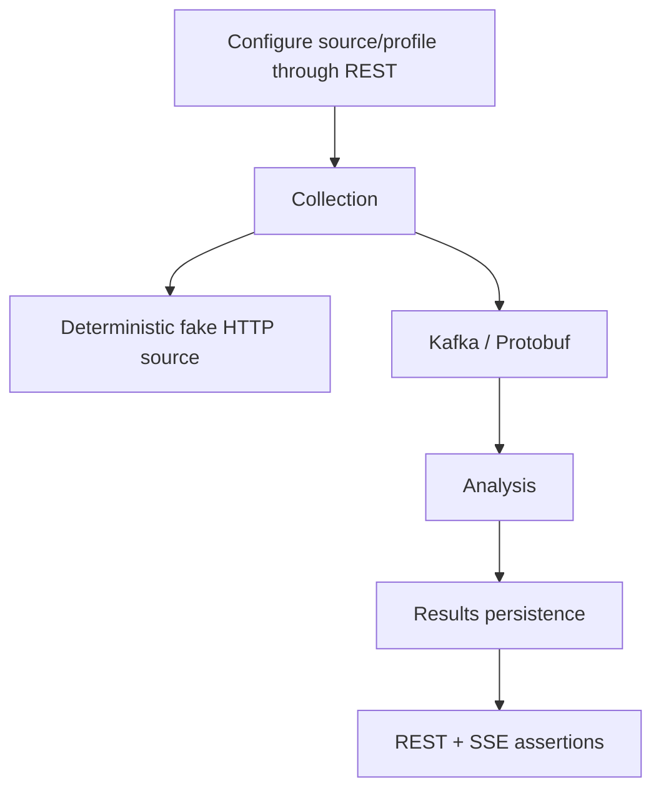

# Tests and validation

## Testing principles

Tests verify behavior and contracts, not implementation trivia.

Default automated tests must not require public network access, live external websites, SaaS accounts, or production credentials.

## Test layers

- module unit/behavior tests live with the owning module;
- contract tests live with API/event contract ownership;
- reusable deterministic fixtures belong in `testing/test-support` only when genuinely shared;
- cross-module/backend integration tests belong in `testing/integration-tests`;
- architectural dependency checks may use ArchUnit when meaningful package boundaries exist.

## Current validation commands

Use the repository Gradle Wrapper.

```bash
./gradlew :modules:configuration:test
./gradlew :modules:collection:test
./gradlew :contracts:event-contracts:test
./gradlew :app:test
./gradlew :testing:integration-tests:test
./gradlew test
```

On systems where executable permission is not preserved after extracting an archive, use `bash ./gradlew ...` or restore the executable bit.

## Integration infrastructure

`modules:configuration` uses PostgreSQL Testcontainers for its persistence/server boundary. `modules:collection` uses Kafka Testcontainers for its producer/consumer transport boundary. `testing:integration-tests` now uses PostgreSQL + Kafka Testcontainers together for the first cross-module collection-run flow. Container-backed tests require a supported Docker-compatible runtime.

External HTTP sources must be deterministic local/fake servers controlled by tests. Blocking HTTP/controller tests must also verify that work is offloaded from Netty event-loop threads when that execution boundary is implemented.

The target end-to-end scenario remains:



## Current tests

The first implementation foundation contains:

- `ApplicationContextTest` for Micronaut context bootstrap;
- `ConfiguredSourceTest` for configuration-boundary invariants;
- `RawItemDiscoveredSerializationTest` for Protobuf round-trip and unknown additive fields;
- `ExternalSourceHttpClientTest` for Micronaut-managed synchronous absolute-URL calls across different hosts, scoped filter headers, HTTP response-exception handling, query preservation, bounded redirects, and response-size enforcement against deterministic loopback servers;
- `MicronautExternalSourceClientTest` for successful/empty responses, transport failure normalization, status mapping, and `Retry-After` preservation with a deterministic clock;
- `SourceFetchCoordinatorTest` for bounded Virtual Thread concurrency, deterministic result ordering, empty batches, and best-effort continuation of queued/in-flight work after a source-level failure;
- `CollectionRunServiceTest` for explicit run identity/correlation, success/partial/failed/empty outcomes, and continued Kafka publication after one publication failure;
- `RawItemIdentityFactoryTest` for stable raw-item identity across fetch timestamps and changed payload identity;
- `MicronautBlockingExecutorTest` for verification that Micronaut's blocking executor is Virtual-Thread backed on the Java 21 baseline and that the collection bean graph resolves with its qualified UTC clock;
- `CollectionConfigurationTest` for Jakarta Validation of invalid concurrency configuration;
- `RawItemDiscoveredMapperTest` for event identity/correlation/provenance mapping and response charset handling;
- `KafkaRawItemEventPublisherTest` for explicit Protobuf byte serialization, topic/key behavior, and failure normalization;
- `KafkaRawItemEventPublisherIntegrationTest` for a real Micronaut producer -> Kafka Testcontainers -> byte-array consumer -> `RawItemDiscovered` round trip;
- `ConfigurationPostgresIntegrationTest` for Flyway bootstrap, persisted CRUD/provider behavior, duplicate-name semantics, and transactional rollback;
- `SourceControllerPostgresTest` for real HTTP CRUD/status validation against PostgreSQL and blocking Virtual Thread execution;
- `SourceLocationValidatorTest` for REST URI validation parity with `ConfiguredSource`.

PostgreSQL Testcontainers tests are implemented in `modules:configuration`, Kafka producer round-trip coverage is implemented in `modules:collection`, and `CollectionRunIntegrationTest` under `testing:integration-tests` verifies persisted enabled-source selection, deterministic local HTTP fetch, partial source failure, run correlation, disabled-source exclusion, and successful Kafka publication. Cross-module consumer-chain tests remain pending until analysis is implemented.

## Python

Python may be used later for independent black-box/load/data tooling. It is not the primary backend integration-test framework.
