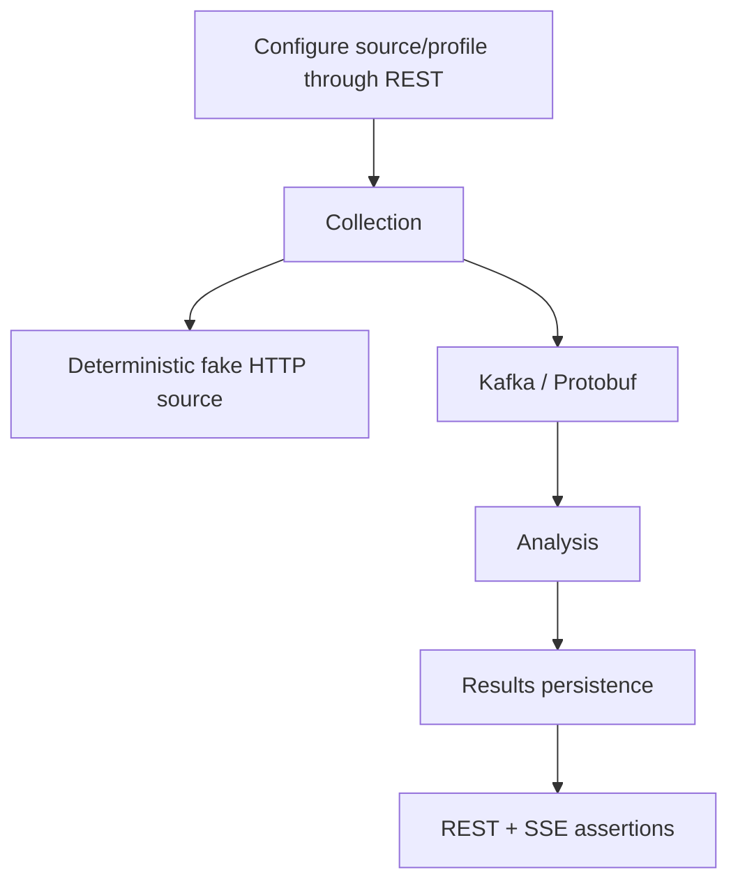

# Tests and validation

## Testing principles

Tests verify behavior and contracts, not implementation trivia.

Default automated tests must not require public network access, live external websites, SaaS accounts, or production credentials.

## Test layers

- module unit/behavior tests live with the owning module;
- contract tests live with API/event contract ownership;
- reusable deterministic fixtures belong in `testing/test-support` only when genuinely shared;
- cross-module/backend integration tests belong in `testing/integration-tests`;
- architectural dependency checks use ArchUnit for the established functional-module package boundaries.

## Current validation commands

Use the repository Gradle Wrapper. The canonical full repository gate is:

```bash
./run_checks.sh
```

`run_checks.sh` performs, in order:

1. `docker info` preflight for container-backed verification;
2. optional `git diff --check` when running inside a Git worktree;
3. `./tools/source-import/run_tests.sh` and `./tools/live-backend/run_tests.sh` for deterministic Python tooling regression coverage;
4. `./infra/kubernetes/run_tests.sh` for deterministic Kubernetes/deployment asset checks without a live cluster;
5. `./gradlew clean check --no-watch-fs`;
6. `./gradlew integrationTest --no-watch-fs --no-parallel`;
7. generation of a temporary FULL archive and validation that it contains `gradle-wrapper.jar` while excluding local/generated artifacts and unrelated JARs.

The script prints a final PASS/FAIL summary for every routine step that actually ran. It also lists relevant test and problems-report locations.

Use focused Gradle commands during development. Run `./run_checks.sh` before treating a substantial PATCH or branch as functionally verified.

Slower coverage, static analysis, dependency analysis, and repository-size metrics run through `./run_rare_checks.sh`. Quality-tool policy and report ownership are documented in [`QUALITY.md`](QUALITY.md).

Fast/default verification compiles and runs only the regular `src/test` source sets:

```bash
./gradlew test
```

Container-backed integration tests live in dedicated `src/integrationTest` source sets. They are structurally absent from the default `test` lifecycle.

A module may therefore have no regular tests even when it owns integration coverage.

Run all container-backed and cross-module integration tests explicitly:

```bash
./gradlew integrationTest --no-watch-fs --no-parallel
```

Focused commands follow the same source-set split:

```bash
./gradlew :modules:configuration:test
./gradlew :modules:configuration:integrationTest
./gradlew :modules:collection:test
./gradlew :modules:collection:integrationTest
./gradlew :modules:analysis:test
./gradlew :modules:analysis:integrationTest
./gradlew :modules:results:test
./gradlew :modules:results:integrationTest
./gradlew :contracts:event-contracts:test
./gradlew :app:test
./gradlew :testing:integration-tests:integrationTest
```

On systems where executable permission is not preserved after extracting an archive, use `bash ./gradlew ...` or restore the executable bit.

When adding integration coverage:

- put Java tests under `src/integrationTest/java`;
- put integration resources under `src/integrationTest/resources` when needed;
- do not put Testcontainers or cross-module scenarios under `src/test` and rely on tags to exclude them from the fast lifecycle.

## Integration infrastructure

Container-backed integration ownership is:

- `modules:configuration` — PostgreSQL persistence/server boundary;
- `modules:collection` — Kafka producer/consumer transport boundary;
- `modules:analysis` — PostgreSQL durable deduplication;
- `modules:results` — PostgreSQL + Kafka terminal-event consumption and idempotent projection persistence;
- `testing:integration-tests` — PostgreSQL + Kafka cross-module Collection Run and Collection-to-Analysis flows.

These tests require a supported Docker-compatible runtime.

The full `integrationTest` suite intentionally disables Gradle project parallelism.

Several modules start PostgreSQL and Kafka Testcontainers. Running those project tasks concurrently can overload developer Docker runtimes and cause container-readiness timeouts.

The normal `clean check` phase may still use its normal parallelism behavior.

External HTTP sources must be deterministic local/fake servers controlled by tests. Blocking HTTP/controller tests must also verify that work is offloaded from Netty event-loop threads when that execution boundary is implemented.

The target end-to-end scenario remains:



## Current tests

The first implementation foundation contains:

- `ApplicationContextTest` for Micronaut context bootstrap;
- `ModuleBoundaryArchitectureTest` protects module boundaries:
  - cross-module dependencies use published APIs only;
  - the functional-module graph is acyclic;
  - published API packages remain framework-free;
  - HTTP adapters do not couple directly to persistence;
  - functional modules do not depend on the application composition root;
- `ConfiguredSourceTest` for configuration-boundary invariants;
- `RawItemDiscoveredSerializationTest` and `AnalysisEventSerializationTest` for Protobuf round trips and unknown additive fields on raw, analyzed, and rejected event families;
- `DeadLetterEventSerializationTest` for round-trip preservation of deterministic dead-letter identity, source Kafka position/payload, failure diagnostics, attempts, and retryability metadata;
- `ExternalSourceHttpClientTest` covers Micronaut-managed synchronous absolute-URL calls against deterministic loopback servers, including:
  - different hosts and preserved query strings;
  - scoped filter headers;
  - HTTP response-exception handling;
  - configured read timeouts;
  - redirect limits;
  - response-size limits;
- `MicronautExternalSourceClientTest` for successful/empty responses, transport failure normalization, status mapping, and `Retry-After` preservation with a deterministic clock;
- `SourceFetchCoordinatorTest` covers bounded Virtual Thread concurrency and backpressure before replacement fetch submission.
  It also covers deterministic source-index reconstruction, empty batches, and best-effort continuation after one source fails;
- `CollectionRunServiceTest` for explicit run identity/correlation, success/partial/failed/empty outcomes, multiple RSS item publications, no-items/extraction-failure semantics, and continued Kafka publication after one publication failure;
- `RawItemIdentityFactoryTest` for stable raw-item identity across fetch timestamps and changed payload identity;
- `MicronautBlockingExecutorTest` for verification that Micronaut's blocking executor is Virtual-Thread backed on the Java 21 baseline and that the collection bean graph resolves with its qualified UTC clock;
- `CollectionConfigurationTest` for Jakarta Validation of invalid concurrency configuration;
- `RssAtomItemExtractorTest` and `DefaultSourceItemExtractorTest` for secure bounded RSS/Atom parsing, metadata extraction, malformed/DTD rejection, feed-item limits, empty feeds, and non-feed passthrough identity compatibility;
- `JsonSourceItemExtractorTest` and `HtmlSourceItemExtractorTest` for configuration-driven JSON Pointer/CSS-selector extraction, semantic metadata, relative URLs, malformed configuration, and generic candidate-item bounds;
- `GenericExtractionConfigurationTest`, `SourceTestConfigurationTest`, and `SourceTestServiceTest` for fail-fast extraction/preview limits plus disabled-source diagnostics, fetch/extraction failures, missing sources, and bounded previews;
- `SourceTestControllerTest` for server-level source-test response mapping, missing/invalid identity handling, and blocking Virtual Thread execution;
- Collection `RawItemDiscoveredMapperTest` for event identity/correlation/provenance mapping including extracted external id, title, publication time, and the effective Monitoring Profile Analysis-settings snapshot;
- `KafkaRawItemEventPublisherTest` for explicit Protobuf byte serialization, topic/key behavior, and failure normalization;
- `KafkaRawItemEventPublisherIntegrationTest` for a real Micronaut producer -> Kafka Testcontainers -> byte-array consumer -> `RawItemDiscovered` round trip;
- `CollectionRunHistoryPostgresTest` covers Collection-owned PostgreSQL history:
  - Flyway bootstrap and extraction-status migration;
  - atomic run/source/item-outcome persistence;
  - application-owned transaction boundaries;
  - restart-safe durable reads;
  - bounded recent-history validation and deterministic ordering;
  - outcome association across multiple runs;
- `ProfileSchedulePostgresTest` for persisted interval state, interval-change rescheduling, and exclusive due-work lease claims across two application contexts sharing PostgreSQL;
- `CollectionRunControllerTest` for server-level manual-run/history status mapping, validation/default limits, required JSON response shape, and blocking Virtual Thread execution without external infrastructure;
- `ConfigurationPostgresIntegrationTest` for Flyway bootstrap, persisted CRUD/provider behavior, restart-safe provider reads, duplicate-name semantics, and transactional rollback for both create and update settings failures;
- `MonitoringProfileControllerPostgresTest` for Monitoring Profile CRUD plus typed Analysis-settings normalization, persistence, replacement-update preservation, invalid settings, and legacy-row compatibility materialization;
- `SourceControllerPostgresTest` for real HTTP CRUD/status validation against PostgreSQL and blocking Virtual Thread execution;
- `SourceLocationValidatorTest` for REST URI validation parity with `ConfiguredSource`;
- `DefaultContentNormalizerTest` for deterministic whitespace/URL normalization and stable normalized identity;
- `KeywordContentAnalyzerTest` for deterministic relevance/classification/scoring from explicit immutable per-item settings;
- Analysis `RawItemDiscoveredMapperTest` for captured-settings authority, legacy-event fallback, and deterministic invalid-snapshot rejection;
- `DeduplicationPostgresIntegrationTest` for durable profile-scoped duplicate claims, discovery counters, real SQL inspection filtering/ordering/limits, and enforcement of the application-owned JDBC transaction boundary;
- `RawItemProcessingPostgresIntegrationTest` covers Analysis PostgreSQL processing:
  - new, irrelevant, and duplicate items;
  - independent cross-profile acceptance;
  - atomic deduplication/outbox commit;
  - persisted outbox trace context and retry metadata;
  - identical-byte republication after Kafka ACK followed by published-marker failure;
  - claim/counter rollback when outbox staging fails;
- `CollectionObservabilityTest` and `AnalysisObservabilityTest` for low-cardinality application metric emission with telemetry disabled safely through no-op boundaries;
- `ApplicationObservabilityTest` for `/health`, liveness/readiness, and deterministic `/prometheus` exposure without PostgreSQL or Kafka;
- `AnalysisItemInspectionControllerTest` for server-level inspection filters, validation/not-found semantics, required nullable JSON fields, and blocking Virtual Thread execution without external infrastructure;
- `RawItemKafkaListenerTest` for Analysis bounded retry recovery, immediate malformed/key/invalid-settings dead-letter handling, retry exhaustion, and no source-offset commit when DLQ publication fails;
- `AnalysisDeadLetterRecoveryControllerTest` for ADMIN recovery request/response validation, status mapping, sanitized payload metadata, confirmation forwarding, and blocking Virtual Thread execution;
- `AnalysisDeadLetterRecoveryKafkaIntegrationTest` for real-DLQ inspection, explicit confirmation, original-byte decoding, and proof that owner-local replay does not append to the shared raw-item topic;
- `TransactionalAnalysisOutboxTest` for analyzed/rejected final topic-key mapping, stable terminal-event serialization, provenance, and outbox staging metadata;
- `AnalysisOutcomeKafkaListenerTest` for Results terminal-event mapping, bounded projection retry, poison-input dead-letter handling, retry exhaustion, and no source-offset commit when DLQ publication fails;
- `ResultsDeadLetterRecoveryControllerTest` for Results recovery HTTP validation, status mapping, confirmation, sanitization, and blocking execution;
- `ResultsKafkaPostgresIntegrationTest` covers real Kafka -> Results listener -> PostgreSQL materialization, including:
  - idempotent retry/upsert behavior;
  - transactional replacement of result tags and attributes;
  - live-cursor advancement only for a new analysis-event identity;
  - poison-record DLQ handling followed by same-partition progress;
  - real Results DLQ inspection/replay, explicit confirmation mismatch, and repeated idempotent projection;
- `ResultControllerTest` for public Results list/detail HTTP defaults, filters/search/cursor request mapping, additive next-cursor response headers, validation/not-found mapping, stable nullable JSON fields, and blocking Virtual Thread execution;
- `ResultLiveControllerTest` for SSE ready/result framing, `Last-Event-ID` resume behavior, live filters, cursor validation, and JDBC polling on the blocking Virtual Thread executor;
- `ResultQueryPostgresIntegrationTest` for real Results SQL filtering, deterministic keyset pagination including timestamp ties, criteria-bound cursors, indexed full-text search, browse-index migrations, ordered tags/attributes, profile-scoped detail reads, durable live polling, and duplicate-analysis-event cursor idempotency;
- `EventObservationMapperTest` for decoded human-readable metadata across the current raw/analyzed/rejected Protobuf event families without copying large content bodies;
- `EventObservationKafkaListenerTest` for bounded recording retry, immediate poison dead-letter handling, and no source-offset commit when Event Observation DLQ publication fails;
- `EventObservationDeadLetterRecoveryControllerTest` for Event Observation recovery HTTP validation, status mapping, confirmation, sanitization, and blocking execution;
- `EventObservationControllerTest` for bounded Event Explorer REST filters, decoded JSON shape, validation, and blocking Virtual Thread execution;
- `EventObservationLiveControllerTest` for `ready`/`event` SSE framing, `Last-Event-ID` resume, technical filters, cursor validation, and blocking-query offload;
- `ProcessingFlowServiceTest` for analyzed, duplicate, in-progress, partial-history, and run-scoped item graph reconstruction with explicit evidence levels;
- `ProcessingFlowControllerTest` for collection-run/item graph routes, stable JSON shape, 404 mapping, and blocking Virtual Thread execution;
- `EventObservationKafkaPostgresIntegrationTest` for real Kafka -> Event Observation -> PostgreSQL decoding, event-id idempotency, selected diagnostics, count-bounded retention, age/count retention interaction, and owner-local DLQ replay preserving source transport metadata without shared-topic republish;
- `CollectionRunIntegrationTest` for persisted enabled-source selection, deterministic local HTTP fetch, source-level partial failure, run correlation, disabled-source exclusion, and successful Kafka publication;
- `CollectionAnalysisIntegrationTest` for persisted source -> deterministic HTTP -> raw Kafka -> analysis -> analyzed/rejected Kafka, including profile-owned Analysis settings overriding deployment compatibility defaults and equivalent normalized rediscovery with different raw ids.
- `HttpPipelineSmokeIntegrationTest` covers the black-box public pipeline:
  - REST source configuration and source-test/generic JSON extraction;
  - manual collection against a deterministic HTTP source;
  - Kafka -> Analysis -> Results -> REST/SSE;
  - decoded Event Observation history;
  - run-scoped Processing Flow reconstruction.
  The source-test branch uses a disabled persisted JSON source and confirms that diagnostics do not create Collection Run history.

PostgreSQL Testcontainers coverage exists in:

- `modules:configuration`;
- `modules:collection`;
- `modules:analysis`;
- `modules:results`;
- `modules:event-observation`.

`modules:collection` also has Kafka producer round-trip coverage.

Cross-module scenarios under `testing:integration-tests` verify Collection Run assembly and the first real consumer chain through normalized deduplication and terminal analysis events.

## Trial-readiness regression gate

Before using real sources for a controlled trial, the backend should keep the following high-risk flow protected:

```text
raw Kafka input
    -> analysis claim/update + serialized outbox append
    -> PostgreSQL transaction commit
    -> input offset commit
    -> lease-based outbox publication
    -> publication marker / retry metadata
```

The Analysis module verifies:

- atomic claim/outbox persistence;
- rollback when outbox staging fails;
- lease-driven outbox publication retry state.

Listener tests verify bounded input retry and terminal DLQ behavior. Recovery controller tests verify the ADMIN HTTP boundary, while Kafka-backed integration coverage exercises real owner-specific DLQ reads and replay. Results integration coverage also proves that a poison record can be dead-lettered while a following record on the same partition still reaches PostgreSQL.

`HttpPipelineSmokeIntegrationTest` starts from Source and Monitoring Profile configuration plus manual Collection REST endpoints.

It observes durable Collection Run history and Analysis inspection through public HTTP APIs. PostgreSQL, Kafka, and the deterministic external source remain behind the backend boundary.

The same smoke test:

- verifies durable analyzed/rejected Results state;
- opens Results SSE before collection and observes the committed analyzed Result;
- waits for Event Observation to expose decoded raw and analyzed events through the public technical-history API.

The opt-in live-backend verifier creates temporary persisted profiles when needed. It terminates at Results REST and includes a deterministic two-entry RSS fixture mode.

## Python tooling tests

Python is used for independent black-box/data tooling. It is not the primary backend test framework.

The source-manifest importer and live-backend verifier own fast standard-library regression tests under:

- `tools/source-import/tests`;
- `tools/live-backend/tests`.

Both self-test suites are part of the canonical `run_checks.sh` gate. The live verifier itself is opt-in and is never invoked automatically against a running backend.

Run them directly with:

```bash
./tools/source-import/run_tests.sh
./tools/live-backend/run_tests.sh
```

These tooling tests use deterministic fakes/loopback HTTP only. They do not require Docker, a running backend, or public network access. Actual `tools/live-backend/verify_pipeline.py` execution is a separate manual/live environment check.


## Authentication and authorization

Focused validation for `SECURITY.IDENTITY_ROLES`, `SECURITY.AUTHENTICATION`, and `SECURITY.AUTHORIZATION`:

```bash
./gradlew :modules:security:test :modules:security:integrationTest --no-watch-fs --no-parallel
./gradlew :testing:integration-tests:integrationTest --tests '*SecurityAuthorizationIntegrationTest' --no-watch-fs --no-parallel
```

Security unit tests protect password hashing and SignalHarvester-specific JWT subject/role claims.

The PostgreSQL/server integration suite covers:

- first-ADMIN bootstrap;
- real login-token signature, issuer, audience, subject, and role claims;
- HttpOnly JWT plus readable CSRF cookies;
- invalid JWT signature, expiry, issuer, and audience rejection;
- explicit USER, VIEWER, ADMIN, and BOT roles;
- CSRF mutation rejection;
- allowed and rejected credentialed CORS origins;
- disablement and logout semantics;
- sequential and concurrent last-enabled-ADMIN protection;
- ADMIN user management without exposing password hashes.

The cross-module application test verifies:

- `VIEWER` access to Results list/detail/SSE;
- denial of VIEWER diagnostic/admin access;
- `ADMIN` without `VIEWER` does not inherit Results access;
- role changes affect newly issued credentials while old JWTs remain stateless;
- USER/BOT-only principals receive no business capability;
- health and Prometheus remain anonymous under security.

Routine acceptance still requires `./run_checks.sh`.

## Application observability

Focused validation for `OBSERVABILITY.APPLICATION`:

```bash
./gradlew :modules:collection:test :modules:analysis:test :app:test --no-watch-fs
./gradlew :modules:analysis:integrationTest --no-watch-fs --no-parallel
```

The unit/server tests protect low-cardinality metrics and management endpoint exposure.

The Analysis PostgreSQL integration suite verifies that terminal-event outbox staging persists the trace context required to reconnect later Kafka publication to the originating processing trace.

Routine acceptance still requires `./run_checks.sh`.

## Event Observation and processing flows

Focused validation for bounded technical event history, SSE, and flow reconstruction:

```bash
./gradlew :modules:event-observation:test :modules:event-observation:integrationTest --no-watch-fs
./gradlew :testing:integration-tests:integrationTest --no-watch-fs
```

Event Observation tests cover:

- decoding of every currently published event family;
- event-id idempotency;
- age/count retention behavior;
- REST filters;
- resumable SSE framing;
- blocking-query offload;
- deterministic Processing Flow reconstruction.

The cross-module HTTP smoke test verifies that raw and analyzed pipeline events become available through the public decoded history API.

It also verifies run-scoped item-flow reconstruction without browser-side Kafka, Protobuf, or PostgreSQL access.

## Results SSE live delivery

Focused validation for the live Results slice:

```bash
./gradlew :modules:results:test :modules:results:integrationTest --no-watch-fs
./gradlew :testing:integration-tests:integrationTest --no-watch-fs
```

Results tests cover:

- durable cursor migration/write semantics;
- filtered polling;
- duplicate analysis-event idempotency;
- SSE framing;
- browser resume by `Last-Event-ID`;
- blocking-executor offload.

The cross-module HTTP smoke test opens SSE before collection. It waits for the same analyzed Result through both SSE and the public Results REST feed.

## Source testing and generic extraction

Focused validation for the configuration-driven extraction/source-test slice:

```bash
./gradlew :modules:collection:test --no-watch-fs
./gradlew :testing:integration-tests:integrationTest --no-watch-fs
```

Collection unit/server tests cover JSON Pointer extraction, HTML CSS selectors, item/preview bounds, diagnostic failures, source-test 404 behavior, and blocking-executor offload.

The cross-module HTTP smoke test persists a disabled REST/JSON source and invokes `/api/v1/sources/{sourceId}/test`. It checks the extracted preview and verifies that the diagnostic operation creates no Collection Run history.

## Operational admin API

Focused validation for the manual-run/history and analysis-inspection slice:

```bash
./gradlew :modules:collection:test :modules:analysis:test :app:test --no-watch-fs
./gradlew :modules:collection:integrationTest :modules:analysis:integrationTest :testing:integration-tests:integrationTest --no-watch-fs --no-parallel
```

Collection tests cover durable PostgreSQL run/source history. Analysis PostgreSQL tests cover bounded inspection of durable normalized-item claims.

Server-level HTTP coverage verifies source CRUD plus the collection-admin and analysis-inspection endpoints. It includes validation/status mapping and blocking Virtual Thread execution.

The operational-admin slice has completed its focused Gradle and container-backed verification, and its spec is archived. These commands remain useful targeted regressions.

## Kubernetes deployment assets

Deterministic infrastructure checks for `DEPLOYMENT.KUBERNETES` and `OBSERVABILITY.INFRASTRUCTURE` run without a live cluster:

```bash
./infra/kubernetes/run_tests.sh
```

They protect:

- Kustomize resource references;
- versioned image tags;
- deployment-owned secret separation;
- backend security, probe, and resource wiring;
- Prometheus, Tempo, Loki, Alloy, and Grafana integration;
- dashboard JSON;
- the non-root backend Docker image contract.

These checks are part of `./run_checks.sh`.

Live cluster verification is deliberately separate because it requires a pre-existing Kubernetes cluster and locally loaded images:

```bash
./infra/kubernetes/verify-local.sh
```

The live script waits for backend/infrastructure rollouts and the topic-provisioning Job. It then verifies:

- backend readiness;
- the Prometheus endpoint;
- healthy Prometheus scrape targets for backend, Redpanda, and kube-state-metrics;
- Grafana health.

Log and trace acceptance requires normal application traffic plus inspection of the provisioned Loki/Tempo data sources. Full umbrella R24 additionally requires a real frontend image from `signalharvester-web`.

## Kubernetes system resilience acceptance

The accepted opt-in resilience gate exercises controlled failure/recovery behavior against the same cluster:

```bash
python3 infra/kubernetes/resilience/run_acceptance.py
```

It is intentionally separate from `./run_checks.sh` because it performs disruptive live actions:

- restarts containers and StatefulSets;
- temporarily changes backend Deployment environment variables;
- injects Kafka traffic;
- uses test-only PostgreSQL state manipulation.

Deterministic parsing/asset checks for the harness are included in `./infra/kubernetes/run_tests.sh`.

The live run covers:

- stateless JWT behavior across a backend restart;
- slow-source availability;
- retry/DLQ behavior during PostgreSQL outage;
- Analysis lag generation and drain;
- Analysis outbox recovery;
- multi-replica scheduler lease behavior;
- Redpanda restart recovery;
- Prometheus, Loki, and Tempo evidence.


## Kubernetes Kafka consumer scaling acceptance

After the backend/infrastructure and resilience live gates have passed, run the opt-in scaling workflow:

```bash
python3 infra/kubernetes/scaling/run_acceptance.py
```

The runner:

1. temporarily scales the backend Deployment to one replica;
2. creates a deterministic bounded Kafka backlog through normal Source/Collection APIs;
3. restores one Analysis consumer;
4. scales the same modular-monolith Deployment to three replicas;
5. verifies shared consumer-group membership and all three raw-event partition assignments;
6. verifies lag reduction/drain without offset manipulation;
7. verifies durable Analysis/Results completeness, outbox completion, DLQ stability, and HTTP availability;
8. restores the original replica count and temporary environment configuration.

Parser/asset coverage stays in `./infra/kubernetes/run_tests.sh`. The live workflow remains outside `./run_checks.sh`. Developer acceptance completed on 2026-09-17 with three distinct Analysis members assigned to raw-event partitions `0`, `1`, and `2`, positive one-replica lag, and final lag `0`.
